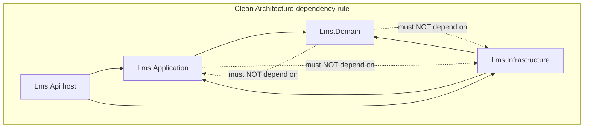

# feat: LMS Walking Skeleton — Foundation Scaffold

## Summary

Scaffold the greenfield monorepo and build the thinnest end-to-end vertical: an `Organization` entity round-tripping through a .NET 8 Clean Architecture backend (Domain → Application → Infrastructure → Api) to a Next.js page, runnable locally via Docker Compose, gated by a CI pipeline whose architecture test enforces the dependency rule. Library choices are locked to free/maintained 2026 options (see Key Technical Decisions). This is the trunk that later Phase 0/1 slices grow on.

---

## Problem Frame

No code exists yet — the project root contains only `docs/`. Building breadth before proving the stack composes risks discovering architecture, tooling, or dev-loop problems late. This plan de-risks the architecture on the smallest possible slice. Full product context lives in the origin requirements doc (see Sources & References).

---

## Requirements

Traced to the origin requirements doc.

**Scaffold & tooling**
- R1. .NET 8 solution under `src/` with Clean Architecture projects `Lms.Domain`, `Lms.Application`, `Lms.Infrastructure`, `Lms.Api` (origin R1).
- R2. Composition root in `Lms.Api` wiring Application + Infrastructure via per-project DI extension methods (origin R2).

**Backend vertical slice**
- R3. Minimal `Organization` aggregate in `Lms.Domain` (id, name, slug, status, timestamps); construction invariants only (origin R3).
- R4. `CreateOrganization` command + `ListOrganizations` query as **martinothamar Mediator** handlers in `Lms.Application`, FluentValidation on the command, `Result<T>` → ProblemDetails error model (origin R4).
- R5. EF Core `DbContext` + Organization config + initial migration + repository in `Lms.Infrastructure` (PostgreSQL/Npgsql) (origin R5).
- R6. `POST /api/v1/organizations` and `GET /api/v1/organizations` in `Lms.Api`, API conventions (camelCase, UUID, ProblemDetails) (origin R6).
- R7. Health endpoints `GET /health/live` and `GET /health/ready` (ready checks PostgreSQL) (origin R7).

**Frontend slice**
- R8. Next.js (App Router) + TypeScript app under `web/` with Tailwind + shadcn/ui + base design tokens (origin R8).
- R9. One page calling `GET /api/v1/organizations` (list) + form to `POST` a new org via TanStack Query, no full reload (origin R9).

**Local infra & CI/tests**
- R10. `docker-compose.yml` at root for PostgreSQL + Redis + MinIO, one-command startup documented in root README (origin R10).
- R11. Architecture test enforcing the dependency rule (origin R11).
- R12. One Testcontainers integration test (create→list round-trip) + ≥1 Domain/Application unit test (origin R12).
- R13. GitHub Actions CI: restore, build, unit + architecture + integration tests, lint `web/`; green (origin R13).

**Working principle**
- R14. `docs/` is start-from-zero context only: when an implementation detail is not clearly determined by docs or this plan, **pause and ask the user** rather than inferring (origin R14). Carries into `ce-work`.

**Origin flows:** F1 (Organization round-trip), F2 (local dev + CI loop)
**Origin acceptance examples:** AE1 (create→list round-trip), AE2 (invalid payload → 422 ProblemDetails), AE3 (web list renders + form adds row), AE4 (dependency-rule violation → CI red), AE5 (Postgres down → ready unhealthy, live healthy)

---

## Scope Boundaries

Carried from origin (the skeleton implements none of these):

- No authentication, JWT/refresh tokens, password handling — Phase 0 proper.
- No RBAC/ABAC, multi-tenancy enforcement, RLS, or org-tree closure table. `Organization` is a bare entity here, **not yet** a tenant boundary.
- No media/video pipeline, HLS, watermark, SCORM.
- No gamification, reporting, AI LMS, DMS, publishing, search.
- No production deployment / IaC / Kubernetes manifests (CI builds + tests only).
- No full seed data (9 ranks / 7 training types / 6 skill groups is a Phase 0 task).
- Organization management beyond create/list (settings, suspend, slug rules).

### Deferred to Follow-Up Work

- First "real" Phase 0 slice — Auth + Members (login/JWT, users, Excel import) — separate plan after this skeleton lands.
- Redis & MinIO **features** (only their connectivity boundary is proven here via a readiness check).
- Dockerfiles for API/web + full-stack containerized compose (host-run dev loop is enough for the skeleton; add when E2E/containerized CI is needed).

---

## Context & Research

### Relevant Code and Patterns

- None local — greenfield repo (only `docs/`). The `docs/technical-design/*` specs are the authoritative patterns to follow: `01-architecture-stack.md` §2.1 (project layout, CQRS, pipeline behaviors), `03-database-schema.md` §2 (`organizations` table), `04-api-design.md` §1/§6 (conventions, ProblemDetails), `design-system/01-foundations.md` §8 (token wiring).

### Institutional Learnings

- None — `docs/solutions/` does not exist yet.

### External References

- Reference structures: Ardalis.CleanArchitecture (Result + Specification + per-project `DependencyInjection.cs`), Jason Taylor CleanArchitecture (Domain/Application/Infrastructure/Web). Both keep `DbContext` + migrations in Infrastructure and compose only in the Api host.
- Walking-skeleton principle: prove every integration boundary with the thinnest behavior; CI pipeline is part of the skeleton. Avoid premature abstraction (no generic `IRepository<T>`, no single-impl interfaces) and leaky EF queries in Application.

---

## Key Technical Decisions

- **CQRS mediator = martinothamar `Mediator` (MIT, source-gen)** — *MediatR v13+ went commercial (2025-07-02); free Community edition is gated < $5M revenue AND < $10M raised, which an enterprise LMS likely fails.* martinothamar keeps the MediatR-style `IRequest`/`IRequestHandler`/`IPipelineBehavior` API, so the spec's pipeline-behavior design ports almost unchanged. Pins: `Mediator.Abstractions` / `Mediator.SourceGenerator` 3.0.2. *(User-confirmed; supersedes the MediatR mention in origin / spec T1 — see U10.)*
- **Object mapping = manual** (one trivial DTO) — avoid AutoMapper (v15+ also commercial); Mapperly available later if mapping grows.
- **UUID v7 = `Medo.Uuid7` behind an `IIdGenerator` port** — `Guid.CreateVersion7` does **not** exist in .NET 8 (it's .NET 9+) and even there is not big-endian/DB-sort-correct. Store as PostgreSQL `uuid`; generate DB-sort-friendly v7 in the Application layer.
- **Result/error model = `Ardalis.Result` + `Ardalis.Result.AspNetCore`** mapped via `.ToMinimalApiResult()` for success/created, plus `AddProblemDetails()` + `UseExceptionHandler()` and an `IExceptionHandler` for the catch-all 500. **Validation failures return 422 by short-circuiting in `ValidationBehavior`** to a 422 `application/problem+json` (built from the FluentValidation errors) — `.ToMinimalApiResult()` maps `Result.Invalid` to **400** by default and has no built-in 422 remap for Minimal APIs, so the invalid branch must not rely on it.
- **Validation = FluentValidation 12.x via a martinothamar Mediator pipeline `ValidationBehavior`** — `FluentValidation.AspNetCore` is deprecated/auto-validation removed; pipeline behavior fits CQRS. (FluentValidation is still free, Apache-2.0.)
- **Architecture tests = `NetArchTest.eNhancedEdition`** — original `NetArchTest.Rules` unmaintained. Terse fluent API matching the spec's intent; ArchUnitNET reserved if richer layer rules are needed later.
- **Persistence access = a focused `IOrganizationRepository`** (no generic repository) implemented in Infrastructure; `DbContext` + migrations live in Infrastructure; design-time: `dotnet ef ... -p src/Lms.Infrastructure -s src/Lms.Api`.
- **Integration tests = Testcontainers.PostgreSql 4.12.0 + `WebApplicationFactory`** (one container per suite via collection fixture; pin `postgres:17-alpine`).
- **Health checks = built-in + `AspNetCore.HealthChecks.NpgSql` 9.0.0**, `live`/`ready` tag split. **`/health/ready` gates on Postgres only** (the dependency the skeleton actually uses); Redis/MinIO connectivity is proven by a **non-gating** check (separate tag/endpoint or logged at startup) so an unused dependency being down does not make readiness fail. Health-check error detail is suppressed outside Development.
- **Frontend = Next.js 15 + React 19 + Tailwind v4 + shadcn CLI (`shadcn@latest init -t next`) + TanStack Query v5** (`gcTime`, object-form `useQuery`).
- **Local dev loop = Docker Compose infra-only**; API (`dotnet run`) + web (`pnpm dev`) on host. *(User-confirmed.)*
- **Central package management** (`Directory.Packages.props`) to pin versions once across projects.

---

## Open Questions

### Resolved During Planning

- CQRS mediator under MediatR's commercial relicensing: **martinothamar Mediator** (user-confirmed).
- UUID v7 on .NET 8 (no built-in): **Medo.Uuid7 behind an `IIdGenerator`**.
- Architecture-test library (NetArchTest unmaintained): **NetArchTest.eNhancedEdition**.
- Minimal API vs Controllers (origin deferred): **Minimal APIs** with endpoint grouping — lighter for a skeleton, pairs with `.ToMinimalApiResult()`.
- Mapping (origin deferred): **manual**.
- Validation → HTTP status: **422 via `ValidationBehavior` short-circuit** (not `.ToMinimalApiResult()`, which defaults `Result.Invalid` → 400).
- Timestamp source: **`DateTimeOffset.UtcNow` inline** — dropped the single-consumer `IClock` seam (matches the no-single-impl-interfaces principle).
- Redis/MinIO health: **non-gating** connectivity check; only Postgres gates `/health/ready`.
- First-migration design-time context: **`IDesignTimeDbContextFactory`** so `dotnet ef migrations add` builds without a running host.

### Deferred to Implementation

- Exact `ValidationBehavior` ordering vs other behaviors (only validation exists now) — settle when a second behavior appears.
- Whether the readiness check for Redis/MinIO uses Xabaril packages vs a lightweight ping — decide while wiring U6; keep it minimal.
- Respawn for DB reset between integration tests — add if/when a second integration test makes cross-test state a problem (one round-trip test may not need it yet).

---

## Output Structure

    lms/
    ├─ src/
    │  ├─ Lms.Domain/                 # Organization, SeedWork (Entity base), no deps
    │  ├─ Lms.Application/            # martinothamar Mediator wiring, ValidationBehavior, Organizations/ (commands, queries, dtos, validators), ports (IOrganizationRepository, IIdGenerator)
    │  ├─ Lms.Infrastructure/         # AppDbContext, EF configs, Migrations/, OrganizationRepository, Uuid7IdGenerator, DependencyInjection.cs
    │  └─ Lms.Api/                    # Program.cs (composition root), Endpoints/Organizations, ProblemDetails, health checks, Serilog
    ├─ tests/
    │  ├─ Lms.Domain.UnitTests/
    │  ├─ Lms.Application.UnitTests/
    │  ├─ Lms.Architecture.Tests/     # NetArchTest.eNhancedEdition dependency rules
    │  └─ Lms.Api.IntegrationTests/   # WebApplicationFactory + Testcontainers
    ├─ web/                           # Next.js (App Router) + Tailwind v4 + shadcn + TanStack Query
    │  ├─ app/                        # organizations page + providers
    │  ├─ components/ui/              # shadcn primitives + tokens
    │  └─ lib/                        # api client, query hooks
    ├─ docker-compose.yml             # postgres, redis, minio
    ├─ Directory.Packages.props       # central version pins
    ├─ Lms.sln
    ├─ .github/workflows/ci.yml
    ├─ .editorconfig  .gitignore
    └─ README.md

> Scope declaration, not a constraint — the implementer may adjust if a better layout emerges. Per-unit **Files** sections are authoritative.

---

## High-Level Technical Design

> *This illustrates the intended approach and is directional guidance for review, not implementation specification. The implementing agent should treat it as context, not code to reproduce.*

Dependency rule (enforced by U2) and request flow (F1):



```
POST /api/v1/organizations {name, slug}
  → Minimal API endpoint (Lms.Api)
  → ISender.Send(CreateOrganizationCommand)            [martinothamar Mediator]
  → ValidationBehavior runs FluentValidation           [422 ProblemDetails on fail]
  → CreateOrganizationHandler (Lms.Application)
       org = Organization.Create(IIdGenerator.NewV7(), name, slug)
       IOrganizationRepository.Add(org); SaveChanges
  → returns Result<OrganizationDto>
  → .ToMinimalApiResult()  →  201 Created + body
GET /api/v1/organizations → ListOrganizationsHandler → Result<IReadOnlyList<OrganizationDto>> → 200
```

---

## Implementation Units

### U1. Monorepo & solution scaffold + local infra

**Goal:** Create the repo skeleton, the .NET solution with all projects wired, central package management, and Docker Compose for infra. Establishes conventions the rest of the plan fills.

**Requirements:** R1, R2 (DI extension stubs), R10

**Dependencies:** None

**Files:**
- Create: `.gitignore`, `.editorconfig`, `README.md`, `Lms.sln`, `Directory.Packages.props`, `Directory.Build.props`, `.env.example`
- Create: `src/Lms.Domain/Lms.Domain.csproj`, `src/Lms.Application/Lms.Application.csproj`, `src/Lms.Infrastructure/Lms.Infrastructure.csproj`, `src/Lms.Api/Lms.Api.csproj`
- Create: `tests/Lms.Domain.UnitTests/…`, `tests/Lms.Application.UnitTests/…`, `tests/Lms.Architecture.Tests/…`, `tests/Lms.Api.IntegrationTests/…` (project files + empty placeholder test)
- Create: `docker-compose.yml`
- Create: `src/Lms.Application/DependencyInjection.cs`, `src/Lms.Infrastructure/DependencyInjection.cs` (empty `AddApplication`/`AddInfrastructure` stubs)

**Approach:**
- `git init` (repo is not yet git). Project references encode the dependency rule: Application→Domain; Infrastructure→Application,Domain; Api→Application,Infrastructure; Domain→(none).
- Central package versions in `Directory.Packages.props` (pins from Key Technical Decisions).
- `docker-compose.yml`: `postgres:17-alpine`, `redis:7-alpine`, `minio` on an explicit named internal network, named volumes. **Published ports bind to `127.0.0.1` only.** Credentials come from a **gitignored `.env`** (commit `.env.example` with placeholders; `.gitignore` excludes `.env`). README states these are **local-only** creds — never reuse in shared/prod environments.
- README: one-command startup (`docker compose up -d`, then backend/web run commands).

**Patterns to follow:** Ardalis/Jason Taylor project layout; per-project `DependencyInjection.cs` composed only in Api.

**Test scenarios:**
- Test expectation: none — scaffolding/config. (Solution must build; verified below.)

**Verification:**
- `dotnet build Lms.sln` succeeds with all 8 projects.
- `docker compose up -d` brings up Postgres/Redis/MinIO; all reachable on documented ports.
- Project references match the dependency rule (asserted by U2).

---

### U2. Architecture tests — dependency rule guardrail

**Goal:** Lock the Clean Architecture dependency rule from the first commit so layering can't rot as features land.

**Requirements:** R11

**Dependencies:** U1

**Execution note:** Write these immediately after scaffold (before feature code) so the guardrail exists first; they pass as layers are added.

**Files:**
- Create: `tests/Lms.Architecture.Tests/DependencyRuleTests.cs`

**Approach:**
- `NetArchTest.eNhancedEdition`. Load the four assemblies once in a fixture; assert: Domain has no dependency on Application/Infrastructure/Api; Application depends on Domain only (not Infrastructure, EF Core, ASP.NET); Infrastructure/EF types not referenced by Domain or Application.
- Optional cheap naming rules: handlers end in `Handler`; domain entities have non-public parameterless ctor.

**Patterns to follow:** `Types.InAssembly(...).That().ResideInNamespace("Lms.Domain").ShouldNot().HaveDependencyOn("Lms.Infrastructure")` style.

**Test scenarios:**
- Happy path — Domain → no dependency on Application/Infrastructure/Api: passes on the clean skeleton.
- Happy path — Application → depends only on Domain: passes.
- Covers AE4. Error path — a deliberate `Lms.Domain` → `Lms.Infrastructure` reference makes `DependencyRuleTests` fail (verify locally by temporarily adding the reference, then revert).

**Verification:**
- All dependency-rule tests green on the clean tree; adding a forbidden reference turns one red (AE4).

---

### U3. Domain — Organization aggregate

**Goal:** Define the `Organization` aggregate and minimal SeedWork.

**Requirements:** R3

**Dependencies:** U1

**Files:**
- Create: `src/Lms.Domain/SeedWork/Entity.cs` (base: `Guid Id`, equality), `src/Lms.Domain/SeedWork/IAggregateRoot.cs`
- Create: `src/Lms.Domain/Organizations/Organization.cs`, `src/Lms.Domain/Organizations/OrganizationStatus.cs`
- Test: `tests/Lms.Domain.UnitTests/OrganizationTests.cs`

**Approach:**
- `Organization.Create(Guid id, string name, string slug)` factory enforcing invariants (non-empty name/slug, slug format, default `status = Active`, `CreatedAt`/`UpdatedAt`). Id is supplied (generated via `IIdGenerator` in Application) — Domain stays free of infra concerns. Private parameterless ctor for EF.
- Mirror the `organizations` table shape in `docs/technical-design/03-database-schema.md` §2 (name, slug, status, timestamps).

**Patterns to follow:** spec `docs/technical-design/02-domain-model-erd.md` §2.1.

**Test scenarios:**
- Happy path — `Create` with valid name/slug → entity with Active status, timestamps set, given id.
- Edge case — empty/whitespace name or slug → guard throws (or returns failure per chosen guard style).
- Edge case — slug normalization/format rule (e.g., lowercased, no spaces) behaves as specified.

**Verification:**
- `Lms.Domain.UnitTests` green; no EF/ASP.NET references in Domain (U2 enforces).

---

### U4. Application — CQRS, Create/List Organization

**Goal:** Wire martinothamar Mediator + validation behavior; implement create + list use cases with `Result<T>` and ports.

**Requirements:** R4

**Dependencies:** U3

**Files:**
- Create: `src/Lms.Application/Abstractions/IOrganizationRepository.cs`, `src/Lms.Application/Abstractions/IIdGenerator.cs`
- Create: `src/Lms.Application/Behaviors/ValidationBehavior.cs`
- Create: `src/Lms.Application/Organizations/Dtos/OrganizationDto.cs`
- Create: `src/Lms.Application/Organizations/Commands/CreateOrganization/{CreateOrganizationCommand,CreateOrganizationHandler,CreateOrganizationValidator}.cs`
- Create: `src/Lms.Application/Organizations/Queries/ListOrganizations/{ListOrganizationsQuery,ListOrganizationsHandler}.cs`
- Modify: `src/Lms.Application/DependencyInjection.cs` (register martinothamar Mediator source-gen, validators, behavior)
- Test: `tests/Lms.Application.UnitTests/CreateOrganizationHandlerTests.cs`

**Approach:**
- `CreateOrganizationCommand(name, slug) : IRequest<Result<OrganizationDto>>`; handler calls `IIdGenerator.NewV7()`, `Organization.Create(...)`, `IOrganizationRepository.AddAsync` + `SaveChangesAsync`, returns `Result.Created(dto)`. Timestamps come from `DateTimeOffset.UtcNow` inline in `Organization.Create` — no `IClock` seam (single consumer; reintroduce when a second appears).
- `ListOrganizationsQuery : IRequest<Result<IReadOnlyList<OrganizationDto>>>`.
- `ValidationBehavior` resolves `IEnumerable<IValidator<TRequest>>`, runs them, and **short-circuits to a 422 `application/problem+json`** (from the failures) **before** the handler — does not use `.ToMinimalApiResult()` for the invalid branch.
- **martinothamar behavior signature differs from MediatR:** `IPipelineBehavior<TMessage,TResponse>.Handle` returns `ValueTask<TResponse>` with `(message, CancellationToken, MessageHandlerDelegate next)`, and behaviors are wired via `AddMediator(opts => …)` (not MediatR's `AddBehavior`) — don't port a MediatR behavior verbatim.
- Manual mapping `Organization → OrganizationDto`.

**Patterns to follow:** spec `01-architecture-stack.md` §2.3 (CQRS handler shape); martinothamar `IPipelineBehavior<,>`.

**Test scenarios:**
- Happy path — valid command → repository receives an Organization, handler returns `Result.Created` with mapped DTO (repo + id generator faked).
- Covers AE2. Error path — invalid command (blank name) → `ValidationBehavior` short-circuits to `Result.Invalid` with field error; handler not invoked.
- Happy path — `ListOrganizations` returns mapped DTOs from the repository (faked).

**Verification:**
- `Lms.Application.UnitTests` green; Application references Domain only (U2).

---

### U5. Infrastructure — EF Core, repository, migration, id generator

**Goal:** Implement persistence against PostgreSQL and the Application ports.

**Requirements:** R5

**Dependencies:** U3, U4

**Files:**
- Create: `src/Lms.Infrastructure/Persistence/AppDbContext.cs`, `src/Lms.Infrastructure/Persistence/Configurations/OrganizationConfiguration.cs`
- Create: `src/Lms.Infrastructure/Persistence/OrganizationRepository.cs`
- Create: `src/Lms.Infrastructure/Identifiers/Uuid7IdGenerator.cs`, `src/Lms.Infrastructure/Persistence/AppDbContextFactory.cs` (`IDesignTimeDbContextFactory<AppDbContext>`)
- Create: `src/Lms.Infrastructure/Persistence/Migrations/*` (initial migration)
- Modify: `src/Lms.Infrastructure/DependencyInjection.cs` (`AddInfrastructure`: Npgsql DbContext, repository, IIdGenerator, health-check registrations)

**Approach:**
- EF config maps `Organization` to `organizations` table (snake_case, `uuid` PK, unique `slug` per org-less skeleton, status as text + check) per `03-database-schema.md` §2.
- `Uuid7IdGenerator` uses `Medo.Uuid7` producing DB-sort-friendly v7 stored as `Guid`.
- `OrganizationRepository` implements `IOrganizationRepository` over `AppDbContext` (no generic repository).
- Initial migration via `dotnet ef migrations add InitialCreate -p src/Lms.Infrastructure -s src/Lms.Api`.
- Provide `AppDbContextFactory : IDesignTimeDbContextFactory<AppDbContext>` (reads a local/default connection string) so `dotnet ef migrations add` can build the context at design time without a running host or full configuration — otherwise the first migration command fails with "Unable to create a DbContext".

**Patterns to follow:** DbContext + migrations in Infrastructure; `03-database-schema.md` DDL.

**Test scenarios:**
- (Behavior proven by U7 integration test against real Postgres.) Unit-level: `Uuid7IdGenerator` returns version-7, monotonic-ish ids.
- Edge case — duplicate slug insert violates the unique constraint (surfaced as a handled failure, asserted in U7).

**Verification:**
- Migration applies cleanly to a fresh Postgres; `AddInfrastructure` resolves all ports.

---

### U6. Api — endpoints, ProblemDetails, health checks, composition root

**Goal:** Expose the HTTP surface, wire the composition root, and prove the container/runtime boundary.

**Requirements:** R2, R6, R7

**Dependencies:** U4, U5

**Files:**
- Create: `src/Lms.Api/Program.cs` (composition: `AddApplication()`, `AddInfrastructure()`, ProblemDetails, exception handler, Serilog, CORS, Swagger, health checks)
- Create: `src/Lms.Api/Endpoints/OrganizationEndpoints.cs` (Minimal API group `/api/v1/organizations`)
- Create: `src/Lms.Api/GlobalExceptionHandler.cs`
- Create: `src/Lms.Api/appsettings.json`, `appsettings.Development.json`

**Approach:**
- Minimal API group: `POST` → `ISender.Send(CreateOrganizationCommand)` → `.ToMinimalApiResult()` (success/created branch); `GET` → list. camelCase JSON, UUID ids. Validation failures return **422** from `ValidationBehavior` (see U4), not `.ToMinimalApiResult()`.
- `AddProblemDetails()` + `UseExceptionHandler()` + `IExceptionHandler` for catch-all 500.
- Health: `MapHealthChecks("/health/live", Predicate=live-tagged-only)`; **`/health/ready` gates on Postgres only** (`AddNpgSql tags:["ready"]`). Redis/MinIO get a **non-gating** connectivity check (separate tag/endpoint or startup log) so an unused dep being down doesn't fail readiness. Suppress check error detail outside Development.
- **CORS:** allow a single **explicit origin from config** (e.g. `http://localhost:3000`); **no wildcard `*`**. Swagger in Development only.
- **Local-only fence:** the org endpoints are intentionally unauthenticated for the skeleton — they and `/health/ready` must stay local until Phase 0 auth lands (see Scope Boundaries / Risks).

**Patterns to follow:** `04-api-design.md` §1 (conventions), §6 (ProblemDetails); spec health-check split.

**Test scenarios:**
- (HTTP behavior proven by U7.) Covers AE1/AE2/AE5 at the integration layer.
- Happy path — Swagger lists the two endpoints in Development.

**Verification:**
- `dotnet run` serves the endpoints; `GET /health/live` 200; `GET /health/ready` 200 when Postgres up.

---

### U7. Backend tests — integration round-trip + unit coverage

**Goal:** Prove the skeleton actually walks end-to-end against real infrastructure, and set the test harness/conventions.

**Requirements:** R12

**Dependencies:** U6 (and U3/U4 for unit tests)

**Execution note:** Start with a failing integration test for the create→list contract, then make it pass.

**Files:**
- Create: `tests/Lms.Api.IntegrationTests/WebAppFactory.cs` (WebApplicationFactory + `IAsyncLifetime` + Testcontainers Postgres)
- Create: `tests/Lms.Api.IntegrationTests/OrganizationEndpointsTests.cs`
- Create: `tests/Lms.Api.IntegrationTests/IntegrationTestCollection.cs` (collection fixture)

**Approach:**
- `PostgreSqlBuilder().WithImage("postgres:17-alpine")`; factory starts container in `InitializeAsync`, overrides the app's Npgsql connection to the container, runs `MigrateAsync()`. One container per suite via `ICollectionFixture`.
- Drive the real HTTP client.

**Test scenarios:**
- Covers AE1. Integration — `POST /api/v1/organizations {name, slug}` returns 201 with a UUID id; subsequent `GET` includes it.
- Covers AE2. Integration — `POST` with blank name → 422 `application/problem+json` listing the field error.
- Covers AE5. Integration — stop/disable Postgres → `GET /health/ready` returns 503/unhealthy while `GET /health/live` stays healthy.
- Edge case — duplicate slug → handled conflict (not an unhandled 500).

**Verification:**
- Integration + unit suites green locally with Docker available.

---

### U8. Frontend — Organizations page

**Goal:** Prove the web→API boundary (CORS, serialization, dev proxy) with a real page, on the design-system tokens.

**Requirements:** R8, R9

**Dependencies:** U1 (scaffold can start early), U6 (live endpoint to call)

**Files:**
- Create: `web/` app via `pnpm dlx shadcn@latest init -t next` (Next.js 15, Tailwind v4, React 19)
- Create: `web/app/providers.tsx` (TanStack Query v5 `QueryClientProvider`), wire in `web/app/layout.tsx`
- Create: `web/app/organizations/page.tsx`, `web/lib/api.ts`, `web/lib/use-organizations.ts`
- Create: token wiring in `web/app/globals.css` per `design-system/01-foundations.md` §8
- Add shadcn primitives: `card`, `button`, `input`, `table`

**Approach:**
- `useQuery` lists organizations; a form `useMutation` POSTs then invalidates the list (no full reload). Object-form `useQuery({queryKey, queryFn})` (v5).
- Empty state: when the list is empty (fresh DB), show a brief empty-state message (e.g., "Chưa có tổ chức nào") instead of a blank area.
- Pending state: while the create mutation is in flight, disable the submit button (or show a loading indicator) to prevent double-submit.
- **Tailwind v4 is CSS-first:** map design-system §8 token *values* into `@theme`/CSS custom properties in `globals.css` — do **not** copy §8's v3-style `tailwind.config.js` snippet verbatim.
- API base URL from env; CORS allowed by U6.

**Patterns to follow:** `design-system/01-foundations.md` (tokens), `02-components.md` (Button/Input/Table/Card specs).

**Test scenarios:**
- Covers AE3. Happy path — with ≥1 org from the API, the page renders the list; submitting the form adds a row without a full page reload (manual verification acceptable for the skeleton; Playwright deferred).
- Error path — API unreachable → page shows an error state, not a crash.

**Verification:**
- `pnpm build` + `pnpm lint` pass; page works end-to-end against the running API.

---

### U9. CI pipeline (GitHub Actions)

**Goal:** Green pipeline that builds + tests both stacks and runs the architecture guardrail.

**Requirements:** R13

**Dependencies:** U2, U7, U8

**Files:**
- Create: `.github/workflows/ci.yml`

**Approach:**
- Two path-gated jobs. `backend`: setup .NET 8, restore, build, run unit + architecture tests (fast, no Docker), then integration tests (Testcontainers uses the runner's Docker); cache NuGet. `frontend`: setup Node + pnpm, install, lint, build; cache pnpm store.
- Order fast→slow; fail the pipeline on any red.

**Test scenarios:**
- Covers AE4. CI — on a branch that violates the dependency rule, the `backend` job fails at the architecture test.
- Happy path — clean push: both jobs green.

**Verification:**
- A PR shows both jobs passing; a deliberate dependency-rule violation fails CI (AE4).

---

### U10. Align spec docs with locked library decisions

**Goal:** Keep the source-of-truth specs truthful after the library decisions (so future readers/agents don't follow stale claims) — honors R14's "docs are reference" intent.

**Requirements:** (consistency; supports R14)

**Dependencies:** None (can run anytime)

**Files:**
- Modify: `docs/technical-design/01-architecture-stack.md` (MediatR → martinothamar Mediator + note licensing; AutoMapper/Mapster → manual/Mapperly; add UUID v7 .NET 8 note; NetArchTest → eNhancedEdition; pin notes)
- Modify: `docs/README.md` stack summary line if it names MediatR.

**Approach:**
- Surgical edits only — replace the specific library mentions and add a one-line rationale; do not rewrite sections. Add an ADR-row note referencing this decision.

**Test scenarios:**
- Test expectation: none — documentation edit.

**Verification:**
- No remaining "MediatR" reference in `docs/` except where explaining why it was avoided.

---

## System-Wide Impact

- **Interaction graph:** martinothamar Mediator pipeline (ValidationBehavior → handler) is the new cross-cutting seam; composition root in `Lms.Api/Program.cs` is the only place that knows Infrastructure.
- **Error propagation:** expected failures → `Result<T>` → ProblemDetails at the endpoint (422 invalid, 409 conflict); unexpected → `IExceptionHandler` → 500 ProblemDetails. No exceptions for control flow.
- **State lifecycle risks:** minimal (single insert/select); duplicate-slug conflict handled, not 500.
- **API surface parity:** endpoints follow `/api/v1` conventions so later slices (Auth, Members) extend the same shape; agent-native parity (ADR-012) preserved — every action is an endpoint.
- **Integration coverage:** the Testcontainers round-trip (U7) is what mocks can't prove (real EF/Npgsql/migration + HTTP serialization).
- **Unchanged invariants:** none yet (greenfield); the dependency rule (U2) is the invariant going forward.

---

## Risks & Dependencies

| Risk | Mitigation |
|------|------------|
| Local toolchain missing (.NET 8 SDK / Node / Docker) | U1 README documents prerequisites; verify on the dev machine before starting (origin assumption) |
| martinothamar Mediator source-gen quirks (registration, AOT) | Keep handlers conventional; register validators/behaviors explicitly; covered by U4 unit + U7 integration |
| UUID v7 index locality (`Guid.CreateVersion7` pitfalls) | Use Medo.Uuid7 (DB-sort-friendly), store as `uuid`; revisit with a bulk-insert check if index bloat appears |
| Testcontainers needs Docker in CI | GitHub-hosted Ubuntu runners include Docker; integration job documented to require it |
| Tailwind v4 / React 19 churn vs shadcn | Use current shadcn CLI defaults (v4/React 19); pin versions; keep the page minimal |
| Scope creep beyond the skeleton | Scope Boundaries explicit; auth/tenancy/features deferred |
| Unauthenticated endpoints / open health checks reach a shared or prod env | Local-only by construction: compose ports bound to `127.0.0.1`, explicit CORS origin, no deploy in scope; auth + access control land in Phase 0 before any non-local deploy |

---

## Documentation / Operational Notes

- Root `README.md` (U1): prerequisites + one-command local startup + how to run backend/web/tests.
- U10 keeps `docs/` accurate after library decisions.
- **R14 working principle:** during `ce-work`, when a detail is unclear (e.g., exact slug rules, status enum values, error-message wording), pause and ask the user — do not infer from docs.

---

## Sources & References

- **Origin document:** [docs/brainstorms/2026-06-03-lms-walking-skeleton-requirements.md](docs/brainstorms/2026-06-03-lms-walking-skeleton-requirements.md)
- Specs: [docs/technical-design/01-architecture-stack.md](docs/technical-design/01-architecture-stack.md), [03-database-schema.md](docs/technical-design/03-database-schema.md), [04-api-design.md](docs/technical-design/04-api-design.md), [docs/design-system/01-foundations.md](docs/design-system/01-foundations.md)
- External (2026 research): MediatR/AutoMapper commercial relicensing (Lucky Penny); martinothamar/Mediator (MIT); `Guid.CreateVersion7` is .NET 9+ and not big-endian (Medo.Uuid7); FluentValidation 12 (auto-validation removed); NetArchTest.eNhancedEdition / ArchUnitNET; Testcontainers.PostgreSql 4.12.0; AspNetCore.HealthChecks.NpgSql 9.0.0; shadcn CLI + Tailwind v4 + React 19 + TanStack Query v5.
