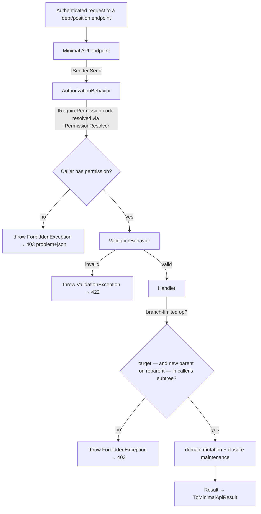

# feat: Authorization Spine + Org Structure (Phase 0)

## Summary

Turn the (already-built) auth slice's role *claims* into enforced *permissions* and build the organization structure that enforcement needs. Adds three Identity-&-Org aggregates — `Department` (full CRUD incl. reparent + delete, backed by a closure table), `Position` (flat org-wide catalog), and `Role` (system permission catalog) — and gives the existing `User` a department + position. Enforcement lands as a martinothamar Mediator `AuthorizationBehavior` (RBAC) plus a dept-branch ABAC guard reading the closure table. The dev seed is extended with a sample tree and branch-scoped manager accounts so enforcement is proven end-to-end on the running stack. Backend + tests only; members/import and all org-management UI are deferred.

This plan builds directly on real code from the identity-auth slice (`docs/plans/2026-06-03-002-feat-identity-auth-slice-plan.md`): the `User` aggregate, `IdentitySeeder`, `HttpTenantContext`/`ITenantContext`/`ICurrentUser`, `JwtTokenIssuer`, `TenantConnectionInterceptor`, the EF global query filter, the `AddRlsAndAppRole` RLS policy, and the `ValidationBehavior` pipeline — all verified present in `src/`.

---

## Problem Frame

The auth slice ships authentication *without* authorization: the JWT carries `roles` (role codes) but nothing enforces them, and `User` has no department/position. The product's highest-rated risk ([P4 §4](../product-development/04-roadmap-metrics.md)) is wrong authorization leaking data across departments/scopes, and member creation (the next slice) is a ⚠️ sensitive operation — so authorization must be real and proven *before* that surface exists.

The only ABAC rule applicable in Phase 0 is **dept-branch** (a branch-scoped manager acts only within its own subtree), which requires the department tree + closure table. Ownership / audience / self ABAC all depend on Phase-1 content/learning entities and are out of scope. This slice therefore builds the org structure and the enforcement spine together, proving both end-to-end via a seeded tree, while deferring members, UI, and the remaining ABAC rules.

Full product/requirements context lives in the origin requirements doc (see Sources & References).

---

## Requirements

Traced to the origin requirements doc.

**Org structure (departments + positions)**
- R1. `Department` aggregate in the Identity & Org context: id (UUID v7), org reference, optional parent, name; invariant: no cycles (origin R1).
- R2. Department **closure table** (ancestor, descendant, depth) for fast subtree queries / ABAC (origin R2).
- R3. Department CRUD: create, rename, **reparent** (rebuilds moved-subtree closure, rejects cycles), delete (origin R3).
- R4. Delete a department is rejected while it has child departments or assigned users (origin R4).
- R5. `Position` aggregate: id, org reference, name, unique per org; flat catalog CRUD; delete rejected while any user holds it (origin R5).

**Identity model extension**
- R6. Extend `User` with optional department + position references and (existing) multi-role assignment; effective permissions = union (origin R6).
- R7. `Role` with code, name, is-system flag, permission codes; seed the seven system roles with the matrix permission sets (origin R7; [P2 §3](../product-development/02-personas-roles.md), [T5 §3.2](../technical-design/05-auth-rbac-tenancy.md)).

**RBAC enforcement**
- R8. Canonical permission-code catalog seeded as data on roles; full matrix seeded, only codes guarding existing endpoints enforced (origin R8; [T5 §3.1](../technical-design/05-auth-rbac-tenancy.md)).
- R9. Commands/queries declare a required permission; a pipeline behavior returns **403 before the handler** when the caller lacks it (origin R9; [T5 §3.3](../technical-design/05-auth-rbac-tenancy.md)).
- R10. Effective permissions resolved **server-side** from roles (origin R10; [T5 §2.1](../technical-design/05-auth-rbac-tenancy.md)). *See Open Questions for the membership-vs-definition immediacy reconciliation.*

**ABAC (dept-branch only)**
- R11. Reusable dept-branch check via the closure table (origin R11; [T5 §4.1](../technical-design/05-auth-rbac-tenancy.md)).
- R12. Branch-limited management runs the guard inside the handler after RBAC; out-of-branch → 403; ownership/audience/self out of scope (origin R12).

**Tenant consistency**
- R13. New tenant-owned tables carry `organization_id` + the EF global query filter, consistent with the auth pipeline (origin R13; [T5 §5.2](../technical-design/05-auth-rbac-tenancy.md)).

**Bootstrap / seeding**
- R14. Extend the dev seed: system roles (with permissions), a multi-level department tree, positions, and branch-scoped manager accounts placed in the tree; seed stays the only provisioning path (origin R14).

**Enforcement surface**
- R15. Wire enforcement onto the new department/position endpoints and retrofit existing org/auth endpoints to declare required permissions (origin R15).

**Tests**
- R16–R19. RBAC role×capability; ABAC dept-branch allow/deny; closure reparent/cycle + delete-block integrity; tenant isolation of the new tables (origin R16–R19).

**Origin flows:** F1 (permission-enforced op / RBAC), F2 (dept-branch scoping / ABAC), F3 (reparent + delete / closure integrity), F4 (seed + end-to-end proof).
**Origin acceptance examples:** AE1 (Learner 403 / OrgOwner success), AE2 (branch in/out), AE3 (reparent closure + cycle reject), AE4 (delete-block then succeed), AE5 (position delete-block + dup-name), AE6 (permission resolution without token reissue — see Open Questions), AE7 (tenant isolation of new tables).

---

## Scope Boundaries

Carried from origin:

- No member create / bulk / Excel-import / lock / role-change / dept-change (UI or API) — provisioning is the seed only.
- No org-management **UI** (department tree view/editor, positions page); app shell + nav (E1) and design-system foundations (D1) are separate slices.
- No ownership / audience-scope / self ABAC — Phase-1 entities don't exist yet; only dept-branch.
- No custom (org-defined) roles or a role-editing surface — only seeded system roles.
- No platform (cross-tenant) role enforcement.

### Deferred to Follow-Up Work

- **Members slice (E8):** member create/import/lock/role-change/dept-change + the org-tree admin UI (the tree is E8-S1's left panel). This is the slice this spine unblocks.
- **`user_roles` join table** ([T3 §2](../technical-design/03-database-schema.md)): not created — role assignment stays as the existing `User.RoleCodes` array (see Key Technical Decisions). Introduce a join table only when per-user custom role rows are needed.
- **Audit logging** of structural/role changes ([T5 §7](../technical-design/05-auth-rbac-tenancy.md)): deferred to the members slice, where account-creation audit (E8-S2) is a hard requirement; this slice adds no `audit_logs` surface. *(User-confirmed call-out.)*
- **Full membership-immediacy** (re-reading user role codes from the DB each request): deferred behind the permission-resolver port (see Open Questions).
- **`lms_app` non-superuser app role promotion:** the role + RLS policies exist; promoting the app's runtime connection to it is still deferred (carried from the auth slice).
- **Dept-claim + role-membership staleness window:** when the members slice adds dept reassignment / role removal, it must close the ~15-min window where a stale `dept`/`roles` claim still authorizes — via per-request DB lookup (the resolver port already takes `userId`) or token invalidation on change. Must be resolved before any reassignment/removal surface ships (origin AE6).

---

## Context & Research

### Relevant Code and Patterns

All paths verified present in `src/`. The new code mirrors these established patterns:

- **Aggregate shape** — `src/Lms.Domain/Users/User.cs`, `src/Lms.Domain/Organizations/Organization.cs`: `sealed class … : Entity, IAggregateRoot`; private EF ctor + private all-args ctor + static `Create(Guid id, …)` holding invariants; `Guid` id supplied by Application (never generated in Domain); foreign refs as plain `Guid` (no EF navigations); collection backing field exposed read-only (`User._roleCodes` → `RoleCodes`); behavior methods take `now` and bump `UpdatedAt`.
- **CQRS** — `src/Lms.Application/Organizations/Commands/CreateOrganization/*`, `…/Queries/GetMyOrganization/*`: one folder per command/query; `sealed record … : IRequest<Result<TDto>>`; `sealed class …Handler` with primary-ctor DI returning `ValueTask<Result<T>>`; Ardalis.Result factories (`Result.Created/Conflict/NotFound/Unauthorized/Forbidden`); manual `ToDto()` mapping; FluentValidation `sealed class …Validator : AbstractValidator<TCommand>` for input shape only.
- **Pipeline behavior** — `src/Lms.Application/Behaviors/ValidationBehavior.cs`: `IPipelineBehavior<TMessage,TResponse> where TMessage : notnull, IMessage`, `Handle(message, MessageHandlerDelegate next, ct)`, **throws** on failure (mapped to HTTP by `GlobalExceptionHandler`) rather than returning a typed `Result`. Registered via `services.AddScoped(typeof(IPipelineBehavior<,>), typeof(...))` in `src/Lms.Application/DependencyInjection.cs` — **registration order = execution order**.
- **EF config** — `src/Lms.Infrastructure/Persistence/Configurations/UserConfiguration.cs`: `ToTable("snake_case_plural")`, per-property `HasColumnName`, enum `HasConversion<string>().HasMaxLength(20)`, composite unique index `HasIndex(x => new { x.OrganizationId, x.Name })`, FK-without-navigation `HasOne<T>().WithMany().HasForeignKey(...).OnDelete(...)`, primitive array `PrimitiveCollection(u => u.RoleCodes)`.
- **DbContext + tenancy** — `src/Lms.Infrastructure/Persistence/AppDbContext.cs`: tenant captured once as `_orgId` scalar; `HasQueryFilter(x => x.OrganizationId == _orgId)` per tenant-owned entity; `organizations` intentionally unfiltered (tenant root).
- **RLS idiom** — `src/Lms.Infrastructure/Persistence/Migrations/20260603125742_AddRlsAndAppRole.cs`: `migrationBuilder.Sql(...)` enabling+forcing RLS and a `USING (organization_id = NULLIF(current_setting('app.current_org', true), '')::uuid)` policy per table; `GRANT`s to `lms_app`. Copy this for the new tenant tables.
- **Tenant/current-user seam** — `src/Lms.Api/Identity/HttpTenantContext.cs` (reads raw `sub`/`org` claims; backs `ITenantContext` + `ICurrentUser`), `src/Lms.Application/Abstractions/ICurrentUser.cs`. Extended here with `RoleCodes` + `CurrentDepartmentId`.
- **JWT** — `src/Lms.Infrastructure/Security/JwtTokenIssuer.cs`: emits `sub`/`org`/`roles`/`mcp`. Extended here with `dept`.
- **Seed** — `src/Lms.Infrastructure/Seeding/IdentitySeeder.cs`: idempotent, dev-only, runs as superuser (RLS-bypassing), called from `src/Lms.Api/Program.cs` dev block. Extended here.
- **Error mapping** — `src/Lms.Api/GlobalExceptionHandler.cs`: central RFC7807; `ValidationException` → 422 with `https://errors.vela.app/<slug>` type URIs. Add a `ForbiddenException` → 403 mapping.
- **Tests** — `tests/Lms.Api.IntegrationTests/WebAppFactory.cs` (Testcontainers `postgres:17-alpine`, exposes `ConnectionString` + `AppRoleConnectionString` for the RLS-subject `lms_app` role), `IntegrationCollection.cs` (shared container), `OrganizationEndpointsTests.cs` (seed-and-login idiom), `TenantIsolationTests.cs`, `IdentitySeederTests.cs`; Application unit tests use **hand-written fakes** (no Moq) asserting `Result.Status`; `tests/Lms.Architecture.Tests/DependencyRuleTests.cs` (NetArchTest.eNhancedEdition) forbids EF/ASP/Npgsql refs in Application.

### Institutional Learnings

- None — `docs/solutions/` does not exist. After this slice lands, `/ce-compound` should capture: how RBAC wires into the Mediator pipeline, the EF-filter-vs-RLS tenancy boundary, the closure-table reparent design, and any UUID-v7 index findings. The only relevant prior notes are plan-level pre-decisions in the walking-skeleton plan (martinothamar registration; Medo.Uuid7 index locality) — inputs, not validated learnings.

### External References

- Closure-table maintenance (create/move/delete) — standard adjacency+closure pattern; reparent = delete the moved subtree's links to old ancestors, insert links from new ancestors (cross-join moved-subtree × new-ancestor-path). No local precedent yet (first hierarchical table); see High-Level Technical Design.
- No external research was run — the stack, conventions, and the directly-relevant specs ([T5](../technical-design/05-auth-rbac-tenancy.md), [T3 §2](../technical-design/03-database-schema.md), [P2](../product-development/02-personas-roles.md)) are well-established locally and on-point. Authorization is high-risk, but the patterns to follow already exist in the auth slice's code.

---

## Key Technical Decisions

- **Roles = role-codes-on-user + a system roles catalog** (not `user_roles` join). The built `User.RoleCodes` (`text[]`) and the JWT `roles` claim already exist; this slice adds a `roles` catalog table (code, name, is_system, permissions `text[]`) seeded as **system rows (`organization_id` NULL)**. Resolution joins the caller's role codes against the cached catalog. *Supersedes [T3 §2](../technical-design/03-database-schema.md)'s `user_roles`/per-org-roles model for now — T3 is overview-level; revisit when custom roles arrive.*
- **RBAC = `AuthorizationBehavior` that throws `ForbiddenException`**, mirroring `ValidationBehavior` (which throws `ValidationException`). A pipeline behavior can't cleanly return a generic typed `Result<T>`, so it throws and `GlobalExceptionHandler` maps to a uniform **403 `application/problem+json`** (`https://errors.vela.app/forbidden`). The ABAC guard in handlers throws the **same** `ForbiddenException` so every 403 has one shape (origin AE2). *Rejected: returning `Result.Forbidden()` from the behavior (awkward generically) and a split 403 shape between RBAC and ABAC.*
- **Authorize before validate.** `AuthorizationBehavior` must run **before** `ValidationBehavior` so an unauthorized caller gets 403 and never reaches validation (avoids leaking input-shape/422 detail). ⚠️ martinothamar Mediator does **not** document open-generic `AddScoped` registration order as execution order (that's a MediatR contract, not theirs — the repo has only ever run one behavior, so the order has never been exercised). Order the two via the compile-time `options.PipelineBehaviors` array in `AddMediator` (the README's documented ordering mechanism), and prove it with a U10 test asserting an unauthorized **and** invalid request returns **403, not 422** — the test turns red if the order inverts.
- **Permissions resolved server-side via a cached catalog, keyed off the JWT `roles` claim.** An `IPermissionResolver` (Application port, Infrastructure impl over `IMemoryCache`) maps role codes → permission set from the system roles catalog. **Permission-*definition* changes are immediate** (catalog is the source); **role-*membership* changes follow the ~15-min access token** (codes come from the token). Acceptable because this slice has no role-reassignment surface; full membership immediacy (per-request DB read of role codes) is a behind-the-port swap deferred to the members slice. *(See Open Questions / origin AE6.)*
- **ABAC dept via a `dept` JWT claim.** `JwtTokenIssuer` adds `dept` (the user's `DepartmentId`); `HttpTenantContext` exposes `CurrentDepartmentId`; the guard reads it + the closure table. Matches [T5 §2.1](../technical-design/05-auth-rbac-tenancy.md)'s claim set and avoids an extra "who am I" read (the guard still reads the closure). ~15-min staleness on dept change is moot (no dept-change surface this slice) — but the members slice **must** close that window when it adds dept reassignment (see Deferred to Follow-Up Work).
- **Branch-guard contract (fail-closed + both endpoints + explicit full-scope).** Three invariants the guard must hold, not just test:
  - **Fail closed:** a branch-limited caller with no `CurrentDepartmentId` is **denied** — the policy helper returns deny, it does **not** fall through to skip the branch check.
  - **Reparent checks both nodes:** `MoveDepartment` runs the branch check on **both** the moved department **and** the new parent. Checking only the moved node lets a branch manager relocate an in-branch subtree under any parent org-wide — an escalation the cycle guard does not prevent.
  - **Full-scope is an explicit signal, not inferred from a shared code:** OrgOwner/OrgAdmin skip the branch check, but they share the `departments.manage` code with the branch-limited LndManager, so "has the unrestricted form of the permission" is unworkable. Use an **explicit full-scope role allowlist** (or a distinct `departments.manage.all` permission held only by OrgOwner/OrgAdmin); absence ⇒ branch-limited. Centralize in one policy helper.
- **`IPermissionResolver.ResolveAsync` takes the caller's `userId`** (alongside role codes), so the deferred per-request DB read of role *membership* is a pure implementation swap behind the port — the members slice never has to widen the interface.
- **New tenant tables get RLS *and* the EF filter.** `departments`, `department_closure`, `positions` carry `organization_id`, get `HasQueryFilter`, and get RLS policies via a migration copying the `AddRlsAndAppRole` idiom — so origin R19 (isolation of new tables) is provable exactly like `TenantIsolationTests` proves it for `users`. The `roles` catalog is **system/global** (org NULL) → not filtered, not RLS'd (like `organizations`).
- **`department_closure` carries `organization_id`.** [T3 §2](../technical-design/03-database-schema.md)'s closure DDL omits it, but T3 §1's convention is "`organization_id` on every tenant-scoped table." Adding it keeps the EF filter + RLS uniform across the tenant surface. *Deliberate deviation from T3's literal closure DDL, consistent with its stated convention.*
- **ABAC-positive subject = `LndManager`, not `DeptManager`.** Per [P2 §3](../product-development/02-personas-roles.md), org-tree management is OrgOwner/OrgAdmin (full) + **LndManager (◐ branch)**; `DeptManager` has **no** tree-management permission (its ◐ is over *users*, which the members slice owns). So the dept-branch ABAC proof uses a branch-scoped `LndManager`; `DeptManager` becomes the RBAC-negative case (403 on tree ops). *Faithful realization of the origin's "branch-scoped manager" intent against the authoritative matrix; the origin used "DeptManager" loosely.*
- **Closure maintenance in the repository (app-side), transactional.** Create inserts self + ancestor links; reparent deletes the moved subtree's old-ancestor links and inserts new ones; delete is blocked unless leaf-and-empty. Recursive-CTE alternative deferred unless performance warrants. *(See High-Level Technical Design.)*
- **Focused repositories, no generic repo** — `IDepartmentRepository`, `IPositionRepository`, `IRoleRepository`, plus a narrow read-only `IDepartmentClosure` for the ABAC guard. Matches the existing `IOrganizationRepository`/`IUserRepository` precedent.
- **No new packages** — Mediator behavior + EF + `IMemoryCache` + xUnit cover it (all already pinned in `Directory.Packages.props`).

---

## Open Questions

### Resolved During Planning

- **RLS extent (origin "deferred to planning"):** extend RLS + EF filter to `departments`/`department_closure`/`positions`; `roles` catalog is system/global (unfiltered). Resolved — copy `AddRlsAndAppRole`.
- **Seed mechanism:** extend the existing dev-only `IdentitySeeder` (called from `Program.cs`). Resolved.
- **System-role storage:** system rows with `organization_id` NULL, referenced by code. Resolved.
- **Permission resolution mechanism:** cached catalog keyed off the JWT `roles` claim (definition-immediate; membership ~15-min). Resolved with caveat below.
- **Closure reparent approach:** app-side delete+reinsert within a transaction. Resolved (algorithm sketched in High-Level Technical Design; exact SQL/LINQ at implementation).
- **Audit timing:** deferred to the members slice (no `audit_logs` this slice). Resolved (user-confirmed).
- **`dept` claim:** added to the JWT for the ABAC guard. Resolved.

### Deferred to Implementation

- Exact closure-rebuild query form (LINQ set ops vs raw `migrationBuilder`/repository SQL vs recursive CTE) — choose while building U2's reparent; correctness is specified, the mechanism is not.
- Whether the cached roles catalog is invalidated on any write (no role-write surface this slice → a process-lifetime cache or short TTL is sufficient; revisit when role editing lands).
- **Origin AE6 reconciliation:** AE6 ("role removed → denied without re-login") cannot be *exercised* this slice (no runtime role-removal surface). What this slice proves instead: changing a role's **permission set** in the catalog changes enforcement with no token reissue (R10's purpose). Full membership immediacy is the deferred per-request-DB-read swap. Flagged so the members slice closes it.
- Exact permission codes for org-structure management — plan uses `departments.read`/`departments.manage` and `positions.read`/`positions.manage` (extending [T5 §3.1](../technical-design/05-auth-rbac-tenancy.md)'s explicitly-illustrative catalog); confirm code spelling while seeding U4.

---

## Output Structure

New and modified files (per-unit **Files** sections are authoritative):

    src/
    ├─ Lms.Domain/
    │  ├─ Departments/Department.cs                      (new)
    │  ├─ Positions/Position.cs                          (new)
    │  ├─ Roles/Role.cs                                  (new)
    │  └─ Users/User.cs                                  (modify: DepartmentId, PositionId, PlaceIn)
    ├─ Lms.Application/
    │  ├─ Authorization/
    │  │  ├─ IRequirePermission.cs                        (new)
    │  │  ├─ AuthorizationBehavior.cs                     (new)
    │  │  ├─ ForbiddenException.cs                        (new)
    │  │  └─ Permissions.cs                               (new: code constants)
    │  ├─ Abstractions/
    │  │  ├─ IDepartmentRepository.cs  IPositionRepository.cs  IRoleRepository.cs   (new)
    │  │  ├─ IPermissionResolver.cs  IDepartmentClosure.cs                          (new)
    │  │  └─ ICurrentUser.cs                              (modify: RoleCodes, CurrentDepartmentId)
    │  ├─ Departments/{Commands,Queries,Dtos}/…           (new)
    │  ├─ Positions/{Commands,Queries,Dtos}/…             (new)
    │  └─ DependencyInjection.cs                          (modify: register AuthorizationBehavior first)
    ├─ Lms.Infrastructure/
    │  ├─ Authorization/PermissionResolver.cs            (new)
    │  ├─ Persistence/
    │  │  ├─ Configurations/{Department,DepartmentClosure,Position,Role}Configuration.cs (new)
    │  │  ├─ Configurations/UserConfiguration.cs          (modify: department_id, position_id)
    │  │  ├─ {Department,Position,Role}Repository.cs      (new)
    │  │  ├─ DepartmentClosure.cs                         (new: IDepartmentClosure impl)
    │  │  ├─ AppDbContext.cs                              (modify: DbSets + filters)
    │  │  └─ Migrations/{*_AddOrgStructureAndRoles, *_AddOrgStructureRls}.cs (new)
    │  ├─ Security/JwtTokenIssuer.cs                      (modify: dept claim)
    │  ├─ Seeding/{IdentitySeeder.cs (modify), SystemRoles.cs (new)}
    │  └─ DependencyInjection.cs                          (modify: new repos, resolver, closure)
    └─ Lms.Api/
       ├─ Endpoints/{DepartmentEndpoints,PositionEndpoints}.cs (new)
       ├─ Identity/HttpTenantContext.cs                  (modify: RoleCodes, CurrentDepartmentId)
       ├─ GlobalExceptionHandler.cs                      (modify: ForbiddenException → 403)
       └─ Program.cs                                     (modify: map new endpoints)
    tests/
    ├─ Lms.Domain.UnitTests/{Department,Position,Role}Tests.cs  (new), UserTests.cs (modify)
    ├─ Lms.Application.UnitTests/{AuthorizationBehavior,DepartmentHandlers,PositionHandlers}Tests.cs (new)
    └─ Lms.Api.IntegrationTests/{DepartmentAuthorization,DeptBranchAbac,DepartmentClosure,
                                  PositionManagement,OrgStructureTenantIsolation,SeedStructure}Tests.cs (new)

> Scope declaration, not a constraint — the implementer may adjust if a better layout emerges.

---

## High-Level Technical Design

> *This illustrates the intended approach and is directional guidance for review, not implementation specification. The implementing agent should treat it as context, not code to reproduce.*

**Request flow with the authorization pipeline (F1 + F2):**



**Closure maintenance (F3) — directional:**

```
create(dept, parentId?):
  insert (dept, dept, 0)                                  -- self link
  if parentId: insert (a, dept, depth+1) for each (a, parentId, depth) in closure  -- inherit parent's ancestors

reparent(dept, newParentId):
  reject if newParentId ∈ subtree(dept)                   -- cycle guard (AE3)
  delete closure rows linking subtree(dept) to its OLD ancestors
       (ancestor ∉ subtree(dept) AND descendant ∈ subtree(dept))
  insert links from each NEW-ancestor (incl. newParent's ancestors) to each node in subtree(dept)

delete(dept):
  reject if dept has child departments OR any users.department_id = dept   -- block-if-non-empty (R4/AE4)
  else delete dept (closure rows cascade)
```

**Permission resolution (R10):** `AuthorizationBehavior` reads the caller's role codes (from `ICurrentUser.RoleCodes`, sourced from the JWT `roles` claim) → `IPermissionResolver.ResolveAsync(roleCodes)` unions permission sets from the cached system roles catalog → membership test against the command's `IRequirePermission.Permission`.

---

## Implementation Units

### Phase A — Structure & Persistence

### U1. Domain — Department, Position, Role aggregates + User placement

**Goal:** Define the three new Identity-&-Org aggregates and extend `User` to hold a department + position.

**Requirements:** R1, R5, R6, R7

**Dependencies:** None

**Files:**
- Create: `src/Lms.Domain/Departments/Department.cs`, `src/Lms.Domain/Positions/Position.cs`, `src/Lms.Domain/Roles/Role.cs`
- Modify: `src/Lms.Domain/Users/User.cs` (add `DepartmentId?`, `PositionId?`; add `PlaceIn(Guid? departmentId, Guid? positionId, DateTimeOffset now)`)
- Test: `tests/Lms.Domain.UnitTests/DepartmentTests.cs`, `PositionTests.cs`, `RoleTests.cs`; modify `tests/Lms.Domain.UnitTests/UserTests.cs`

**Approach:**
- Mirror `Organization`/`User`: `sealed class … : Entity, IAggregateRoot`, private EF ctor + static `Create(Guid id, Guid organizationId, …)`, `Guid` refs (no navigations), behavior methods take `now`.
- `Department`: `OrganizationId`, `ParentId?`, `Name`, timestamps. `Create` validates non-empty name. `Rename(name, now)`. `Reparent(newParentId, now)` sets `ParentId` and rejects `newParentId == Id` (self-parent); the **subtree-cycle** check needs the closure and lives in the handler/repository (U6), not the aggregate.
- `Position`: `OrganizationId`, `Name`, timestamps; `Create`/`Rename`. Uniqueness is a DB constraint (U2), not a domain invariant.
- `Role`: `Code`, `Name`, `IsSystem`, `Permissions` (read-only collection, normalized like `User.RoleCodes`). `Create` validates non-empty code; org-scope (NULL for system) is a persistence concern.
- `User.PlaceIn`: sets department/position refs + bumps `UpdatedAt` (used by the seed now, members slice later). Keep `User.Create`'s signature unchanged (auth slice depends on it).

**Patterns to follow:** `src/Lms.Domain/Users/User.cs` (factory, normalization, `now`-bearing mutators), [T2 §2.1](../technical-design/02-domain-model-erd.md).

**Test scenarios:**
- Happy — `Department.Create` with valid name → Active-equivalent defaults, timestamps, given id, null parent allowed (root).
- Edge — empty/whitespace name → `ArgumentException` (Department, Position, Role).
- Edge — `Department.Reparent(self)` → rejected (self-parent guard).
- Happy — `Role.Create` normalizes/dedupes permission codes; `Position.Create` trims name.
- Covers R6. Happy — `User.PlaceIn(deptId, posId)` sets both refs and bumps `UpdatedAt`; `User.Create` still produces a user with null department/position.

**Verification:** `Lms.Domain.UnitTests` green; no EF/ASP refs in Domain (enforced by `DependencyRuleTests`).

---

### U2. Persistence — schema, closure maintenance, tenancy for the new tables

**Goal:** Map the new aggregates + closure to PostgreSQL, add the migration(s), wire DbSets + global filters + RLS, and implement repositories incl. transactional closure maintenance.

**Requirements:** R1, R2, R3, R4, R5, R13

**Dependencies:** U1

**Execution note:** Add characterization/integration coverage for closure create/reparent/delete against real Postgres early (U10 houses the end-to-end proofs; a focused closure test can lead here) — closure math is the riskiest correctness surface.

**Files:**
- Create: `src/Lms.Infrastructure/Persistence/Configurations/{DepartmentConfiguration,DepartmentClosureConfiguration,PositionConfiguration,RoleConfiguration}.cs`
- Modify: `src/Lms.Infrastructure/Persistence/Configurations/UserConfiguration.cs` (`department_id`, `position_id` columns + FKs `OnDelete(Restrict)`)
- Modify: `src/Lms.Infrastructure/Persistence/AppDbContext.cs` (DbSets + `HasQueryFilter` for departments/closure/positions; **not** roles)
- Create: `src/Lms.Infrastructure/Persistence/{DepartmentRepository,PositionRepository,RoleRepository}.cs`, `src/Lms.Infrastructure/Persistence/DepartmentClosure.cs`
- Create: `src/Lms.Infrastructure/Persistence/Migrations/*_AddOrgStructureAndRoles.cs`, `*_AddOrgStructureRls.cs`
- Modify: `src/Lms.Infrastructure/DependencyInjection.cs` (register the new repos + `IDepartmentClosure` scoped)

**Approach:**
- Configs follow `UserConfiguration`: snake_case, plural tables (`departments`, `department_closure`, `positions`, `roles`), `HasColumnName`, FK-without-navigation. `positions` unique `(organization_id, name)`; `roles` unique `(organization_id, code)`; `department_closure` PK `(ancestor_id, descendant_id)` + index on `descendant_id`. **`department_closure` carries `organization_id`** (see Key Decisions).
- `AppDbContext`: add `Departments`, `DepartmentClosure`, `Positions`, `Roles` DbSets; `HasQueryFilter(x => x.OrganizationId == _orgId)` on departments, closure, positions. **Roles unfiltered** (system/global, like `organizations`) — *and no roles-listing endpoint ships this slice.* If a future slice adds one it must gate on `org.manage` and return only system rows; if per-org custom roles are ever added to this table, the EF filter + RLS must be retrofitted in the same migration that introduces them.
- Migration 1 (`AddOrgStructureAndRoles`): tables, indexes, FKs, plus `users.department_id`/`users.position_id` columns. Generate via `dotnet ef migrations add … -p src/Lms.Infrastructure -s src/Lms.Api` (design-time factory already exists).
- Migration 2 (`AddOrgStructureRls`): copy `AddRlsAndAppRole` — `ENABLE`/`FORCE` RLS + `NULLIF(current_setting('app.current_org', true),'')::uuid` policy on `departments`/`department_closure`/`positions`; `GRANT` to `lms_app`. (Roles excluded — system/global.)
- `DepartmentRepository`: CRUD + transactional closure maintenance (insert-with-ancestors, reparent rebuild, delete-with-block per the design sketch). `IDepartmentClosure.IsInBranchAsync(ancestorDeptId, targetDeptId)` = closure existence check.
- **Closure `organization_id` is set explicitly from the department's org on every insert — never inherited from the DbContext `_orgId`.** The seed runs with no HTTP context, so `_orgId` is `Guid.Empty` at seed time; if closure rows took their org from the filter context they'd land empty and the EF filter would then hide them (RLS isolation would "pass" against empty data). Stamp `organization_id` from the owning department in the repository's closure writes.
- **IDOR control = the EF filter; handlers must never call `IgnoreQueryFilters()`** on department/position lookups. A cross-tenant id then silently resolves to NotFound (correct). State this convention so an implementer doesn't "fetch then verify org manually" and reintroduce IDOR.
- `RoleRepository`: read system roles by code (for the resolver) + add/exists (for the seed).

**Patterns to follow:** `src/Lms.Infrastructure/Persistence/Configurations/UserConfiguration.cs`, `AppDbContext.cs`, the `AddRlsAndAppRole` migration, `OrganizationRepository.cs`.

**Test scenarios:**
- Happy — migration applies cleanly to a fresh Postgres; all tables/indexes/policies created (asserted via U10 boot + a smoke query).
- Integration (lead-in to U10) — create a 3-level tree → closure rows correct (self + every ancestor at right depth); `IsInBranchAsync(root, leaf)` true, `IsInBranchAsync(sibling, leaf)` false.
- Integration — reparent a mid node → old-ancestor links for the whole moved subtree gone, new-ancestor links present; depths correct.
- Edge — duplicate position name per org → unique-constraint violation surfaced as a handled conflict (asserted in U7).

**Verification:** migration up/down clean; `AddInfrastructure` resolves the new ports; closure integration checks green.

---

### Phase B — Authorization Enforcement

### U3. RBAC pipeline — AuthorizationBehavior, permission resolver, 403 mapping

**Goal:** Enforce required permissions in the Mediator pipeline before handlers, resolving permissions server-side from the cached roles catalog.

**Requirements:** R8, R9, R10, R15

**Dependencies:** U1, U2

**Execution note:** Test-first — write the `AuthorizationBehavior` denial test (fake `ICurrentUser` + fake resolver) before the behavior, so "remove the check → test goes red" holds (origin success criterion).

**Files:**
- Create: `src/Lms.Application/Authorization/{IRequirePermission,AuthorizationBehavior,ForbiddenException,Permissions}.cs`
- Create: `src/Lms.Application/Abstractions/IPermissionResolver.cs`
- Modify: `src/Lms.Application/Abstractions/ICurrentUser.cs` (add `IReadOnlyCollection<string> RoleCodes`)
- Modify: `src/Lms.Application/DependencyInjection.cs` (register `AuthorizationBehavior` **before** `ValidationBehavior`)
- Create: `src/Lms.Infrastructure/Authorization/PermissionResolver.cs` (reads roles catalog via `IRoleRepository`, caches via `IMemoryCache`)
- Modify: `src/Lms.Infrastructure/DependencyInjection.cs` (register `IPermissionResolver`)
- Modify: `src/Lms.Api/Identity/HttpTenantContext.cs` (expose `RoleCodes` from the `roles` claim)
- Modify: `src/Lms.Api/GlobalExceptionHandler.cs` (`ForbiddenException` → 403 `application/problem+json`, `type = https://errors.vela.app/forbidden`)
- Test: `tests/Lms.Application.UnitTests/AuthorizationBehaviorTests.cs`

**Approach:**
- `IRequirePermission { string Permission { get; } }` marker on commands/queries.
- `AuthorizationBehavior<TMessage,TResponse>` (same signature as `ValidationBehavior`): if `message is IRequirePermission p`, **first** check `ICurrentUser.IsAuthenticated` (false → throw `ForbiddenException` immediately, before resolution — keeps the behavior safe in any context, not only `.RequireAuthorization()` HTTP requests), then resolve the caller's permissions and throw `ForbiddenException` when `p.Permission` is absent; else `await next`. Order it before `ValidationBehavior` via the compile-time `options.PipelineBehaviors` array (see Key Decisions — do **not** rely on `AddScoped` registration order).
- `IPermissionResolver.ResolveAsync(Guid userId, IEnumerable<string> roleCodes, ct)` → permission set; impl unions the cached system roles' permission arrays. **Cache TTL is a security bound, not a nicety: cap at ≤ the access-token lifetime (15 min)** so a corrected/revoked permission definition can't outlive the token it was issued under. (`userId` is taken now so the deferred membership-immediacy swap is additive — see Key Decisions.)
- `HttpTenantContext.RoleCodes` reads **all** role claims: `Principal?.FindAll("roles").Select(c => c.Value)` — **not** `FindFirstValue`. With `MapInboundClaims = false`, `JwtTokenIssuer`'s `roles` array materializes as multiple separate `"roles"` claims, so `FindFirstValue` would collapse a multi-role user to their first role and break R6's union (the correct `FindAll("roles")` idiom already exists in `tests/Lms.Infrastructure.UnitTests/JwtTokenIssuerTests.cs`).
- `Permissions` static class: code constants used by `IRequirePermission` declarations (`departments.read/manage`, `departments.manage.all` for full-scope, `positions.read/manage`, plus the existing org/auth ones referenced in U8).
- **403 mapping must be the first branch** in `GlobalExceptionHandler.TryHandleAsync` (`ForbiddenException` → 403 `application/problem+json`, `type = https://errors.vela.app/forbidden`), before the catch-all 500 — the handler has no `Forbidden` branch today, so without this every denial falls through to 500 and leaks detail in Development.

**Patterns to follow:** `src/Lms.Application/Behaviors/ValidationBehavior.cs` (throw-not-return), `src/Lms.Api/GlobalExceptionHandler.cs`, `src/Lms.Api/Identity/HttpTenantContext.cs`.

**Test scenarios:**
- Covers AE1. Happy/deny — a command requiring `departments.manage`: caller whose roles resolve to that permission → `next` invoked; caller without → `ForbiddenException` thrown, `next` **not** invoked.
- Edge — message not implementing `IRequirePermission` → behavior passes through untouched.
- Edge — empty role set / unknown role code → no permissions → denied.
- Edge — `IsAuthenticated == false` message implementing `IRequirePermission` → `ForbiddenException` (does **not** proceed to resolution with empty roles).
- **Multi-role union** — a user with two roles (e.g. OrgOwner + LndManager) resolves to the **union** of both permission sets; a fake/seeded `ICurrentUser` must expose >1 role so a `FindFirstValue` single-role collapse fails the test.
- Covers R10. Resolver — role codes mapped to the union of their catalog permission sets; changing a role's permission set (catalog) changes the resolved set with no token involvement.
- (Integration, in U10) Ordering — an unauthorized **and** invalid request returns **403, not 422** (proves authorize-before-validate); a forbidden request returns **403 problem+json, not 500** (proves the `GlobalExceptionHandler` branch).

**Verification:** `Lms.Application.UnitTests` green; `DependencyRuleTests` still green (Application authz code references ports only, no EF/ASP).

---

### U4. Permission catalog + system-roles seed data

**Goal:** Encode the canonical permission codes and the seven system roles' permission sets, and seed the roles catalog.

**Requirements:** R7, R8, R14

**Dependencies:** U2, U3

**Files:**
- Create: `src/Lms.Infrastructure/Seeding/SystemRoles.cs` (role code → permission codes, from the matrix)
- Modify: `src/Lms.Infrastructure/Seeding/IdentitySeeder.cs` (idempotently upsert the system roles catalog)
- (Permission code constants live in `src/Lms.Application/Authorization/Permissions.cs` from U3.)
- Test: covered by `tests/Lms.Api.IntegrationTests/SeedStructureTests.cs` (U9/U10) + a resolver unit check (U3).

**Approach:**
- `SystemRoles`: the full [P2 §3](../product-development/02-personas-roles.md) / [T5 §3.2](../technical-design/05-auth-rbac-tenancy.md) matrix as data — OrgOwner = all codes; OrgAdmin = all except `org.manage`; LndManager, DeptManager, Instructor, Learner, Auditor per the matrix. Seed the **full** set of illustrative codes (origin R8) even where no endpoint enforces them yet; add `departments.*`/`positions.*` codes this slice enforces.
- Seeder upserts system roles (`organization_id` NULL, `is_system = true`) idempotently (skip if present), before/with the org+owner seed.
- Mapping note: org-tree management → OrgOwner/OrgAdmin hold **`departments.manage.all`** (the explicit full-scope signal that makes the ABAC guard skip the branch check) plus `departments.manage`; LndManager holds **only `departments.manage`** (branch-limited by ABAC). `positions.manage` to OrgOwner/OrgAdmin/LndManager (flat, no ABAC). DeptManager gets none of these (its ◐ is over users — deferred). Since OrgOwner/OrgAdmin already seed with "all codes," `departments.manage.all` falls out naturally; the seed just must **not** grant it to LndManager.

**Patterns to follow:** `src/Lms.Infrastructure/Seeding/IdentitySeeder.cs` (idempotency, dev-only).

**Test scenarios:**
- Covers R7, R8. Integration — after seed, the roles catalog contains the seven system roles with expected permission arrays (OrgOwner ⊇ everyone; Learner has none of `departments.manage`/`positions.manage`).
- Edge — re-running the seed does not duplicate roles.

**Verification:** seed populates roles once; resolver returns expected permissions per role.

---

### U5. ABAC dept-branch — closure guard + dept claim

**Goal:** Enforce that branch-limited managers act only within their own department subtree.

**Requirements:** R11, R12

**Dependencies:** U2, U3

**Execution note:** Test-first on the in/out-of-branch decision (fake `IDepartmentClosure` + fake `ICurrentUser`).

**Files:**
- Create: `src/Lms.Application/Abstractions/IDepartmentClosure.cs` (read-only `IsInBranchAsync(Guid ancestorDeptId, Guid targetDeptId, ct)`)
- Modify: `src/Lms.Application/Abstractions/ICurrentUser.cs` (add `Guid? CurrentDepartmentId`)
- Modify: `src/Lms.Infrastructure/Security/JwtTokenIssuer.cs` (emit `dept` when set)
- Modify: `src/Lms.Api/Identity/HttpTenantContext.cs` (expose `CurrentDepartmentId` from the `dept` claim)
- (Impl `DepartmentClosure.cs` created in U2; the guard is applied inside dept handlers in U6.)

**Approach:** implements the **Branch-guard contract** from Key Technical Decisions — its three invariants are the spec, not just test cases:
- The guard (used in U6 handlers, after RBAC): full-scope callers (explicit allowlist / `departments.manage.all`) skip the branch check; branch-limited callers must have `CurrentDepartmentId` present (**absent ⇒ deny, fail closed — never fall through to skip**) and `IsInBranchAsync(CurrentDepartmentId, targetDepartmentId)` true; else throw `ForbiddenException` (uniform 403 with RBAC).
- **Reparent is the two-node case:** for `MoveDepartment`, a branch-limited caller must pass `IsInBranchAsync` for **both** the moved department **and** the new parent. The cycle guard (reject `newParentId ∈ subtree(dept)`) does **not** cover this — without the new-parent check a branch manager can relocate an in-branch subtree under any org-wide parent (escalation).
- Full-scope detection uses the explicit signal from Key Decisions (allowlist / distinct code), not "has `departments.manage`" — keep it in one policy helper so handlers stay thin.
- `dept` claim added to the token at issue time. ~15-min staleness acceptable this slice (no dept-change surface); the members slice must close the window when dept reassignment lands (Deferred to Follow-Up Work).

**Patterns to follow:** [T5 §4.1, §4.3](../technical-design/05-auth-rbac-tenancy.md); `src/Lms.Infrastructure/Security/JwtTokenIssuer.cs` claim shape; `src/Lms.Api/Identity/HttpTenantContext.cs` claim reads.

**Test scenarios:**
- Covers AE2. Allow/deny — branch-scoped caller in dept X: target ∈ subtree(X) → allowed; target ∉ subtree(X) → `ForbiddenException`.
- Edge — full-scope caller (OrgOwner): branch check skipped (manages anywhere).
- Edge — branch-scoped caller with no `CurrentDepartmentId` → denied (fail closed, not skipped).
- **Reparent escalation** — branch-scoped caller moves an in-branch dept to an **out-of-branch** new parent → `ForbiddenException` (both-node check); moving within the branch → allowed.
- Edge — branch-limited caller holding `departments.manage` but **not** the full-scope signal is treated as branch-limited (not full-scope).
- Unit — `IsInBranchAsync` true for self, direct child, deep descendant; false for sibling, parent, unrelated.

**Verification:** unit + (U10) integration in/out-of-branch green; token carries `dept` for placed users.

---

### Phase C — Feature Surfaces

### U6. Department use cases + endpoints

**Goal:** Department create/rename/move/delete + read, enforced by RBAC and (for branch-limited roles) the ABAC guard, with closure maintenance and the delete-block + cycle invariants.

**Requirements:** R3, R4, R9, R11, R12, R15

**Dependencies:** U2, U3, U5

**Files:**
- Create: `src/Lms.Application/Departments/Commands/{CreateDepartment,RenameDepartment,MoveDepartment,DeleteDepartment}/{*Command,*Handler,*Validator}.cs`
- Create: `src/Lms.Application/Departments/Queries/{ListDepartments,GetDepartment}/*.cs`, `src/Lms.Application/Departments/Dtos/DepartmentDto.cs` (+ a tree/node DTO)
- Create: `src/Lms.Api/Endpoints/DepartmentEndpoints.cs`; Modify: `src/Lms.Api/Program.cs` (`app.MapDepartmentEndpoints()`)
- Test: `tests/Lms.Application.UnitTests/DepartmentHandlersTests.cs`

**Approach:**
- Commands `: IRequest<Result<T>>, IRequirePermission` (`departments.manage`); queries require `departments.read`. Handlers: primary-ctor DI, `ValueTask<Result<T>>`, Ardalis factories.
- Create/Move/Delete call the repository's closure-aware methods (U2). Move runs the cycle guard (reject `newParentId ∈ subtree(dept)`); Delete runs block-if-non-empty (children or assigned users) → `Result.Conflict`/clear error. Branch-limited callers run the ABAC guard (U5) before mutating — on the target dept for create/rename/delete, and on **both the moved dept and the new parent** for move (per the Branch-guard contract). Lookups go through the tenant-filtered context — never `IgnoreQueryFilters()`.
- Minimal API group `/api/v1/departments` (`.RequireAuthorization()`, `.Produces`/`.ProducesProblem`), `ISender.Send` + `.ToMinimalApiResult()`; request DTOs as co-located `sealed record`s.
- List returns the org's tree (flat nodes with `parentId`, or nested) for the future members-page consumer.

**Patterns to follow:** `src/Lms.Application/Organizations/**`, `src/Lms.Api/Endpoints/OrganizationEndpoints.cs`.

**Test scenarios:**
- Covers AE1. Deny — Learner role → create-department 403 (RBAC, no handler work); OrgOwner → created.
- RBAC-negative — DeptManager → create/rename/delete-department 403 (no tree permission).
- Covers AE2. ABAC — LndManager in branch X: rename a dept in subtree(X) → success; rename a dept outside X → 403.
- ABAC reparent — LndManager in X moves an in-branch dept to an out-of-branch new parent → 403 (both-node check); moves within X → success.
- Covers AE3. Reparent — move rebuilds closure; moving a dept under its own descendant → rejected.
- Covers AE4. Delete — dept with a child or an assigned user → rejected (conflict); empty leaf → deleted.
- Edge — rename to blank → 422 (validator) only for callers who passed RBAC (authorize-before-validate).

**Verification:** unit handlers green with fakes; endpoints reachable; behaviors proven end-to-end in U10.

---

### U7. Position use cases + endpoints

**Goal:** Position create/rename/delete + list as a flat org-wide catalog, RBAC-enforced, with the held-by-user delete-block and per-org name uniqueness.

**Requirements:** R5, R9, R15

**Dependencies:** U2, U3

**Files:**
- Create: `src/Lms.Application/Positions/Commands/{CreatePosition,RenamePosition,DeletePosition}/*.cs`, `Queries/ListPositions/*.cs`, `Dtos/PositionDto.cs`
- Create: `src/Lms.Api/Endpoints/PositionEndpoints.cs`; Modify: `src/Lms.Api/Program.cs` (`app.MapPositionEndpoints()`)
- Test: `tests/Lms.Application.UnitTests/PositionHandlersTests.cs`

**Approach:**
- Commands require `positions.manage`; list requires `positions.read`. No ABAC (positions are flat/org-wide). Create → `Result.Conflict` on duplicate name per org. Delete → block (conflict) if any user holds the position.
- Same endpoint/handler patterns as U6.

**Patterns to follow:** U6; `src/Lms.Application/Organizations/Commands/CreateOrganization/*` (conflict handling).

**Test scenarios:**
- Covers AE5. Conflict — create with a name already used in the org → 409/conflict; delete a position a user holds → rejected; delete an unused position → success.
- Deny — non-manager role → 403 on manage ops.
- Happy — list returns the org's positions; tenant-scoped (proven in U10).

**Verification:** unit green; endpoints reachable.

---

### U8. Retrofit existing endpoints with permission requirements

**Goal:** Close the "authenticated-but-not-authorized" gap on already-shipped surfaces by declaring required permissions where appropriate.

**Requirements:** R15

**Dependencies:** U3

**Files:**
- Modify: existing commands/queries under `src/Lms.Application/Organizations/**` (and any auth commands that are management actions) to implement `IRequirePermission` where a permission gate applies.
- (No endpoint signature changes — enforcement is in the pipeline.)

**Approach:**
- Audit existing requests: `GetMyOrganizationQuery` is self-scoped (any authenticated user reads their own org — likely **no** permission gate, just `.RequireAuthorization()`); `CreateOrganizationCommand` is seed/platform-only (gate behind a high permission or leave unmapped as it's not an exposed endpoint). Login/refresh/change-password are pre-authz flows — **not** gated. Document each decision inline.
- The point is deliberate, audited decisions — not blanket gating. Anything genuinely public/self-scoped stays ungated with a one-line rationale.

**Patterns to follow:** U3 `IRequirePermission`; the existing endpoints' `.RequireAuthorization()` usage.

**Test scenarios:**
- Covers R15. For each retrofitted management request: the gated permission is enforced (covered where an endpoint exists); self-scoped/pre-authz requests remain reachable by an authenticated non-privileged user (regression — login/`/me` still work).
- Regression — existing `AuthFlowTests`/`OrganizationEndpointsTests` stay green.

**Verification:** existing integration suites green; newly-gated actions deny appropriately.

---

### Phase D — Proof

### U9. Seed extension — sample tree, positions, branch-scoped managers

**Goal:** Provision a realistic structure and the accounts needed to demonstrate RBAC + ABAC end-to-end, idempotently, as the only provisioning path.

**Requirements:** R14

**Dependencies:** U1, U2, U4

**Files:**
- Modify: `src/Lms.Infrastructure/Seeding/IdentitySeeder.cs` (after roles + org + owner: seed a department tree, positions, and placed manager/learner accounts)
- Possibly extend `SeedOptions` (Infrastructure/auth options) for the demo accounts' credentials; keep dev-only.
- Test: `tests/Lms.Api.IntegrationTests/SeedStructureTests.cs`

**Approach:**
- Seed a small tree, e.g. `Org root → { Sales → { Sales/East, Sales/West }, Engineering }`, with closure maintained via the repository (U2).
- Seed positions (e.g. `Manager`, `Agent`).
- Seed accounts (all `mustChangePassword = true`): an **LndManager placed in `Sales`** (ABAC-positive subject), a **DeptManager placed in `Sales/East`** (RBAC-negative on tree ops), and a **Learner** (RBAC-negative). OrgOwner already seeded.
- Idempotent throughout (skip existing by email/slug/name). Runs as superuser (RLS-bypassing) and **bypasses the Mediator pipeline** — it calls repositories directly, so `AuthorizationBehavior`/`ICurrentUser` (empty with no HTTP context) are never in the seed path. Because there is no tenant context, every department/closure/position row written here must have `organization_id` stamped **explicitly** from the seeded org (see U2) — relying on the DbContext filter would write `Guid.Empty`.

**Patterns to follow:** `src/Lms.Infrastructure/Seeding/IdentitySeeder.cs`.

**Test scenarios:**
- Covers R14. Integration — after seed: tree + closure present; positions present; the placed accounts exist with the right roles + departments; re-running the seed is a no-op (no duplicates).

**Verification:** `SeedStructureTests` green; seeded users can log in and receive a token carrying their `dept`.

---

### U10. Integration tests — RBAC × ABAC × closure × isolation

**Goal:** Prove the spine end-to-end against the running stack: enforcement, branch scoping, closure integrity, delete-block, and tenant isolation of the new tables.

**Requirements:** R16, R17, R18, R19

**Dependencies:** U6, U7, U9

**Execution note:** These are the origin's acceptance examples; treat them as the definition of done for the slice. Mirror `OrganizationEndpointsTests`' seed-and-login idiom and `TenantIsolationTests`' `lms_app`-role connection for the RLS proof.

**Files:**
- Create: `tests/Lms.Api.IntegrationTests/DepartmentAuthorizationTests.cs`, `DeptBranchAbacTests.cs`, `DepartmentClosureTests.cs`, `PositionManagementTests.cs`, `OrgStructureTenantIsolationTests.cs` (join `IntegrationCollection`)

**Approach:** seed (U9), log in as each persona, drive the real HTTP client, assert status + body shape (uniform 403 `problem+json`). For isolation, query the new tables through the RLS-subject `lms_app` connection to prove the policy independently of the EF filter.

**Test scenarios:**
- Covers AE1, R16 — role × capability: OrgOwner manages tree/positions; Learner and DeptManager get 403 on tree management; each gated action allowed only for roles holding the permission.
- Covers AE2, R17 — LndManager in `Sales`: manages `Sales/East`/`Sales/West` (200); 403 on `Engineering`; OrgOwner manages all.
- Covers AE3, R18 — reparent `Sales/East` under `Engineering`: closure reflects new ancestors for the moved node; moving `Sales` under `Sales/East` → rejected (cycle).
- Covers AE4, R18 — delete `Sales` (has children/users) → rejected; delete an empty leaf → 200.
- Covers AE5 — position held by the seeded LndManager → delete rejected; unused position → deleted; duplicate name → conflict.
- Covers AE7, R19 — two orgs each with a tree: org-A user lists/manages only org-A departments/positions; a direct `lms_app`-connection query for org-B rows under org-A's session var returns none (RLS), independent of the EF filter.
- Covers AE6 (partial) — changing a role's catalog permission set changes enforcement on the next request with no token reissue; full membership-removal immediacy noted as deferred (no runtime surface).
- **Pipeline ordering** — an unauthorized **and** invalid request returns **403, not 422** (authorize-before-validate); a forbidden request returns **403 `application/problem+json`, not 500** (the `GlobalExceptionHandler` branch).
- **Reparent escalation** — LndManager in `Sales` moves `Sales/East` under `Engineering` (out of branch) → **403** (both-node ABAC), not a silent tree restructure.
- **Cross-tenant IDOR** — an Org-A session sending a valid **Org-B department id** to a department endpoint returns **404** (EF filter), not 200/403.
- **Multi-role union** — a user seeded with two roles is authorized for the union of both permission sets (guards against a single-role `FindFirstValue` collapse).

**Verification:** all new integration tests green with Docker available; `DependencyRuleTests` green; existing suites unaffected.

---

## System-Wide Impact

- **New cross-cutting seam:** the `AuthorizationBehavior` runs before `ValidationBehavior` for *every* request — a misordered or over-broad `IRequirePermission` could lock out legitimate callers or leak access. Mitigated by U3/U10 tests and the explicit ordering decision.
- **Identity model change:** `User` gains `department_id`/`position_id` (nullable, FK `Restrict`) and the JWT gains a `dept` claim — additive, backward-compatible with existing tokens (claim simply absent for unplaced users).
- **Tenancy surface grows:** three new tenant tables join the EF-filter + RLS regime; `department_closure` newly carries `organization_id`. Isolation is re-proven for them (U10).
- **403 contract:** a new uniform 403 `application/problem+json` (`https://errors.vela.app/forbidden`) joins the 422 contract; later slices reuse it. Agent-native parity preserved — every management action is an enforced endpoint.
- **Error propagation:** authorization denials (RBAC + ABAC) throw `ForbiddenException` → central handler → 403; validation throws → 422; expected domain failures → `Result` → ProblemDetails. No silent control-flow returns.
- **Unblocks:** the members slice (E8) builds member CRUD/import + the org-tree UI on this structure + enforced authz without reworking the pipeline, closure, or `User`.

---

## Risks & Dependencies

| Risk | Mitigation |
|------|------------|
| Closure reparent math wrong → corrupted subtree visibility / ABAC bypass | Transactional rebuild; dedicated closure integration tests (U2 lead-in, U10 AE3); cycle guard; block-if-non-empty delete |
| Reparent escalation — branch manager relocates an in-branch subtree under an out-of-branch parent | ABAC checks **both** moved dept and new parent (U5/U6 contract); U10 reparent-escalation test (out-of-branch new parent → 403) |
| Seed writes closure rows with empty `organization_id` (no tenant context) → RLS/ABAC silently break against empty data | Stamp `organization_id` explicitly from the owning dept on every closure write (U2); seed bypasses the filter context (U9); U10 AE7 proves isolation against seeded data |
| Multi-role user collapses to first role (`FindFirstValue`) → missing permissions | `HttpTenantContext.RoleCodes` uses `FindAll("roles")`; U3/U10 multi-role union test |
| AuthorizationBehavior ordering/over-broad gate locks out legitimate users | Authorize-before-validate decision; per-action audited gates (U8); role×capability matrix test (U10 AE1) |
| 403 denials fall through to 500 (handler has no `Forbidden` branch today) / diverge in shape | `GlobalExceptionHandler` gains a `ForbiddenException`→403 **first branch**; both RBAC + ABAC throw it; U10 asserts 403 (not 500/422), uniform body |
| New tenant tables leak cross-org (esp. closure with no own `organization_id`) | Add `organization_id` to closure; EF filter + RLS on all three; isolation proven via `lms_app` connection (U10 AE7) |
| Roles-as-codes diverges from T3's `user_roles` → future rework | Documented deliberate decision; resolver behind a port; join table deferred cleanly |
| Permission membership staleness (~15-min token) misread as immediacy | Explicit in Key Decisions + Open Questions; no role-reassignment surface this slice; per-request DB read is a behind-the-port swap later |
| martinothamar behavior order NOT guaranteed by `AddScoped` registration order | Order via the compile-time `options.PipelineBehaviors` array; U10 asserts unauthorized+invalid → 403 not 422 (red if order inverts) |
| Depends on the auth slice's code staying as-is | Built + verified in `src/`; this plan references concrete files; any auth refactor should re-check `ICurrentUser`/`JwtTokenIssuer`/seed touchpoints |

---

## Documentation / Operational Notes

- No new runtime config beyond optional dev `SeedOptions` for demo accounts (dev-only; never reuse credentials).
- After the slice lands, run `/ce-compound` to capture the RBAC-pipeline, tenancy-boundary, and closure-table decisions (first hierarchical + authorization territory in the repo).
- **Ask-don't-assume (origin R14 lineage):** during `ce-work`, if a detail is unclear (exact permission-code spelling, closure query form, branch-vs-full-scope role policy), pause and ask rather than infer.

---

## Sources & References

- **Origin document:** [docs/brainstorms/2026-06-03-lms-authorization-org-structure-requirements.md](../brainstorms/2026-06-03-lms-authorization-org-structure-requirements.md)
- **Adjacent built slice:** [docs/plans/2026-06-03-002-feat-identity-auth-slice-plan.md](2026-06-03-002-feat-identity-auth-slice-plan.md) (the User/auth/tenant/RLS code this plan extends)
- **Walking skeleton:** [docs/plans/2026-06-03-001-feat-lms-walking-skeleton-plan.md](2026-06-03-001-feat-lms-walking-skeleton-plan.md)
- Specs: [T5 Auth/RBAC/Tenancy](../technical-design/05-auth-rbac-tenancy.md), [P2 Personas/Roles](../product-development/02-personas-roles.md), [T2 Domain Model](../technical-design/02-domain-model-erd.md), [T3 §2 Schema](../technical-design/03-database-schema.md), [T4 API Design](../technical-design/04-api-design.md), [P4 §4 Risks](../product-development/04-roadmap-metrics.md)
- Verified code patterns: `src/Lms.Application/Behaviors/ValidationBehavior.cs`, `src/Lms.Infrastructure/Persistence/AppDbContext.cs`, `src/Lms.Infrastructure/Persistence/Migrations/20260603125742_AddRlsAndAppRole.cs`, `src/Lms.Infrastructure/Seeding/IdentitySeeder.cs`, `src/Lms.Infrastructure/Security/JwtTokenIssuer.cs`, `src/Lms.Api/Identity/HttpTenantContext.cs`, `src/Lms.Api/Program.cs`
