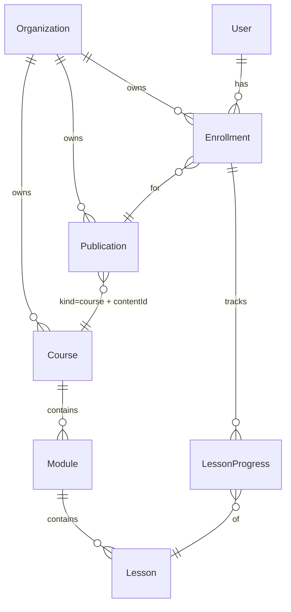
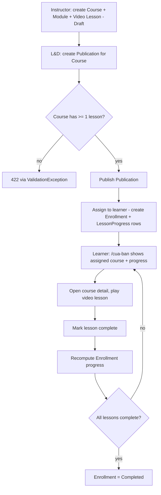

# feat: First learning loop — author, publish, assign, learn, complete

## Summary

Build the first vertical slice of the Phase 1 MVP: an instructor authors a Course (Module → Video Lesson), an L&D manager publishes a minimal Publication for it and assigns it to a learner, and the learner sees the assigned course on `/cua-ban`, plays the video lesson, marks it complete, and watches progress recompute and complete the enrollment. This is **slice 1 of several** toward the roadmap's Phase 1 demo — it delivers `create → assign → learn → progress`, but **not yet** the dynamic watermark or rank-up that the full Phase 1 demo definition (`docs/product-development/04-roadmap-metrics.md`) calls for; those land in the media and gamification slices. Treat this slice as proof that the content/publishing/learning contexts wire through the existing auth and tenancy spine.

---

## Problem Frame

The .NET foundation (identity/auth, organization tree, RBAC/ABAC, tenant isolation) and the locked Vela design system exist, but the product has no *learning* yet — no content, no publishing, no learn loop. The roadmap (Phase 1) calls for vertical slices that each ship end-to-end value. This slice delivers the smallest end-to-end learn loop that proves the new contexts wired through auth and tenancy, deferring the heavy pieces (media pipeline, gamification engine) to their own slices. Its primary value is internal (plumbing proven end-to-end); the learner-facing motivational payoffs (protected video, rank-up) are the deferred half, so do not present this slice to prospects as the content-protection or gamification story.

---

## Requirements

### Authoring
- R1. An instructor can create a Course (Draft) with a title and slug (optional category, description, thumbnail), scoped to their organization.
- R2. An instructor can add ordered Modules to a course, and ordered Video Lessons to a module, each lesson carrying an `https` video URL and duration.
- R3. Course/module/lesson authoring is gated by RBAC (`courses.create`/`courses.update`, held by Instructor and above) and is tenant-isolated.

### Publishing and assignment
- R4. A role holding `publications.create`/`publications.publish` (L&D manager, Dept manager, org admin — **not** the bare Instructor role, which lacks `assignments.create`) can create a Publication for a course and publish it; publishing requires the course to have at least one lesson.
- R5. A published Publication can be assigned to one or more learners, creating one Enrollment (Source = Assigned) per learner, seeded with a LessonProgress row per lesson. (This explicit-assign action is a temporary scaffold for publish-to-audience fan-out — see KTDs.)
- R6. Publish and assign are gated by RBAC (`publications.create`/`publications.publish`, `assignments.create`), are tenant-isolated, assigning an unpublished Publication is rejected, and the assign batch is bounded and all-or-nothing.

### Learning
- R7. A learner sees their assigned courses (enrollments) with progress on `/cua-ban`.
- R8. A learner can open an assigned course's detail (modules/lessons with per-lesson completion state) and play a video lesson.
- R9. A learner can mark a lesson complete; completion recomputes enrollment progress and marks the enrollment Completed when all lessons are done. Re-completing an already-complete lesson is idempotent.
- R10. A learner can only see and act on their own enrollments; another user's or another organization's enrollment returns 404.

### Authorization and tenancy
- R11. Tenant-owned aggregate-root tables (`courses`, `publications`, `enrollments`) enforce isolation via both the EF global query filter and Postgres RLS. Child tables (`modules`, `lessons`, `lesson_progress`) carry no `organization_id` and are isolated transitively through their parent FK, matching the canonical schema (`docs/technical-design/03-database-schema.md`) — they are only ever loaded through a tenant-scoped parent aggregate.
- R12. New permission codes are enforced via `IRequirePermission` and reuse the codes already seeded in `SystemRoles`. The constant values must match the seeded literals byte-for-byte; a build/test guard asserts every enforced permission exists in the seed. No role's seeded permission set is changed.

### Web
- R13. The `/cua-ban` learner queue renders live enrollment data (replacing `mock-lms`), in the warm learner register; the rank/points sidebar regions render as a clearly-labeled disabled "coming soon" placeholder, not plausible mock numbers next to live data.
- R14. A course-detail / lesson-player surface lets the learner watch and mark a lesson complete, wired to the API, with empty/loading/error states.
- R15. A minimal authoring/publish surface (calm register, isolated route) lets a privileged user create, publish, and assign a course end to end. This requirement is optional for the loop (see U10) — the loop is fully provable via the U7 integration test (seeded course) plus U9.

---

## Key Technical Decisions

- Mirror the Departments vertical slice for the *flat* parts (Domain `Create` factory + `now`-taking mutators, Application `Command`/`Query` + `Handler` + `Validator` + manual DTO mapper, Infrastructure `IEntityTypeConfiguration` + sealed repository, minimal-API endpoint with private nested request records and `.ToMinimalApiResult()`). Note the existing `Create` factories stamp timestamps via `DateTimeOffset.UtcNow` internally — only mutators take `now`; follow that, not a `now`-taking factory.
- In-aggregate child-entity collections are a **new pattern** in this codebase, not a Departments mirror. Existing aggregates are flat; the only owned collection (`User._roleCodes`) uses `PrimitiveCollection` (a column, not a child table) and is not transferable. `Course→Module→Lesson` and `Enrollment→LessonProgress` map private backing-field collections to their own tables: per-child `IEntityTypeConfiguration`, the navigation configured with `PropertyAccessMode.Field`, FK to parent `OnDelete(DeleteBehavior.Restrict)`, repositories load children via string-based `Include`. This is the slice's real technical novelty — gate it with `dotnet ef migrations add` building cleanly and a focused round-trip persistence test (U3), not only the end-to-end U7 path.
- Tenancy model is split by aggregate boundary. Only the three aggregate roots carry `organization_id` + EF query filter + RLS policy + `lms_app` grant. `modules`/`lessons`/`lesson_progress` are isolated transitively via their parent FK (mirroring how the canonical schema models them). A `HasQueryFilter` on a child entity that has no `organization_id` is impossible — do not attempt it; rely on the parent aggregate never loading children outside a tenant-scoped query.
- Enrollment points at Publication, not Course, to preserve the documented shared-progress seam (`docs/technical-design/02-domain-model-erd.md` §3.1). Only the **Enrollment→Publication foreign-key seam** is cheap to preserve now; the publish/assign *control flow* will be reworked when audience targeting lands (publish gains a "≥1 audience target" precondition and enrollment creation migrates to publish-time fan-out over `publication_targets`). The minimal `publications` row still populates the canonical NOT-NULL `kind` (= `course`), `content_type`, and `content_id` so no column back-fill is needed later. The canonical "≥1 audience target" publish invariant is **deferred, not dropped** — recorded in Scope Boundaries.
- `AssignPublication(publicationId, userIds[])` is a **temporary scaffold**. The spec creates enrollments by publishing to an audience (`PublicationPublished` event over targets), not via an explicit user-id command. This command exists to make the one-learner loop demonstrable now; the audience-scope slice replaces it with publish-time fan-out. It is guarded by `assignments.create`.
- The "publish requires ≥1 lesson" gate yields 422 by throwing a FluentValidation `ValidationException` from the publish handler (the only path `GlobalExceptionHandler` maps to 422). Handler `Result.Conflict`→409, `Result.Invalid`→400 — neither yields 422, so do not use them for this gate.
- Defer gamification entirely. `LearnerProfile`/`PointTransaction`/`Rank` is a separate context with no event bus; awarding points now would balloon the slice. `/cua-ban` surfaces progress; the rank/points regions render as a disabled "Sắp ra mắt" placeholder (not mock numbers beside live data).
- Video is a plain `https` `VideoUrl` on Lesson — no `MediaAsset`, HLS, signed URL, or dynamic watermark. The `AddLesson` validator enforces `https://` scheme (no `file://`/internal hosts); the server never fetches the URL. Accepted risk for this slice: the URL is an unauthenticated bearer link a learner could share — operators must host on access-controlled storage, and this slice's video must not be shown as the content-protection story. The `VideoUrl→MediaAsset` migration is known rework, recorded in Scope Boundaries.
- Synchronous completion. `CompleteLesson` mutates the LessonProgress row and recomputes enrollment progress in one transaction — no domain events or outbox (none exist). The spec's `LessonCompleted`/`CourseCompleted` events are the designed seam to Gamification/Reporting; deferring emission is a known migration cliff (those slices retrofit emission and have no retroactive events for pre-event completions) — recorded in Scope Boundaries, not framed as cost-free.
- No `DepartmentBranchGuard` on course authoring (courses are org-wide content); learner reads/writes are scoped by `currentUser.UserId` in the handler, and the lesson-membership check uses the enrollment's already-loaded in-memory LessonProgress collection (no separate Course lookup on the hot path, to avoid a cross-enrollment existence oracle). Whether `CreatePublication` should be course-author-scoped is left org-wide for this slice (any privileged role may publish any in-tenant course) — recorded as an accepted boundary.
- Lesson completion endpoint is `POST /api/v1/enrollments/{enrollmentId}/lessons/{lessonId}/complete` rather than the spec's `POST /lessons/{id}/complete`; course detail is `GET /api/v1/enrollments/{enrollmentId}` rather than `GET /courses/{slug}/detail`. Rationale: both actions are meaningless without enrollment context, and enrollment-scoped routes make the ownership/404 check explicit. Documented deviations from `docs/technical-design/04-api-design.md` §4.7; the future `/lessons/{id}/progress` endpoint should adopt the same enrollment-scoped shape for consistency.
- Web data access stays client-side `fetch` + TanStack Query through the same-origin proxy; no Next route handlers or server actions. For `/cua-ban` (currently an async server component that awaits `searchParams`), keep a thin server shell that awaits `searchParams` and renders a `"use client"` child for the live-data regions — the client child cannot be `async`.

---

## High-Level Technical Design

New aggregates and how they attach to the existing Organization/User spine (child entities carry no `organization_id` — they inherit tenancy through their parent):

The end-to-end loop and its one hard gate (publish requires a lesson):

Every command/query runs through the existing pipeline (Authorization behavior before Validation behavior); the three new aggregate-root tables join the `AppDbContext` query-filter block and the RLS policy set so tenant isolation holds without per-handler effort.

---

## Scope Boundaries

### In this slice
The authoring → publish → assign → learn → complete loop for a single Course with Video Lessons, full-stack, honoring existing tenant/RBAC enforcement.

### Deferred to follow-up slices (planned, not dropped)
- Gamification: `LearnerProfile`, `PointTransaction`, 9 ranks, leaderboard, points-on-completion.
- Media pipeline: `MediaAsset`, upload URL, FFmpeg/HLS transcode, signed playback URL, dynamic email watermark (the anti-leak requirement). Includes the `VideoUrl`→`MediaAsset` migration.
- Audience-scope enforcement (`INTERNAL`/`PARTNER`/`GUEST`), the canonical "≥1 audience target" publish invariant, and publish-to-audience fan-out that **replaces the temporary `AssignPublication` command**.
- Analytics event emission (`lesson.completed`, `course.completed`, `assignment.created`) and the domain-events/outbox seam to Gamification/Reporting — the new handlers are the future emission points; pre-event completions will not be back-filled.
- Published-course editing/versioning — published courses are treated as immutable in this slice (no re-sync of existing enrollments).
- Rich publish settings (sequential, expiry, training hours, training type, public/quick-add); self-enrollment, Explore, Library; exams, learning paths, question bank; Excel/bulk import; course categories CRUD; in-course reports; a full people-picker for assignment.

### Out of scope (non-goals for this slice)
- Drag-and-drop reorder polish and rich-text course descriptions.
- Course archive/lifecycle beyond a Draft/Published/Archived status field.
- i18n message-catalog work beyond Vietnamese-first labels already in use.

---

## Implementation Units

Phased: A (backend domain + persistence) → B (backend application + API) → C (web).

### Phase A — Backend domain and persistence

### U1. Course aggregate (Course / Module / Lesson)
- Goal: Model the content aggregate with authoring invariants.
- Requirements: R1, R2.
- Dependencies: none.
- Files:
  - `src/Lms.Domain/Courses/Course.cs` (aggregate root, owns modules)
  - `src/Lms.Domain/Courses/Module.cs`, `src/Lms.Domain/Courses/Lesson.cs`
  - `src/Lms.Domain/Courses/LessonType.cs` (enum: `Video`; closed for this slice — maps to a plain integer column, no TPH implications)
  - `tests/Lms.Domain.UnitTests/CourseTests.cs`
- Approach: `Course.Create(id, organizationId, title, slug)` (stamps timestamps internally, matching existing factories) starts in `Draft`. `AddModule(id, title, now)` and `Module.AddLesson(id, title, videoUrl, durationSeconds, now)` append with auto-incremented `Order`. Expose `LessonCount`/`HasAnyLesson` for the publish gate. Modules/lessons are in-aggregate entities behind read-only collections backed by private fields; no `organization_id` on children (tenancy is inherited from Course).
- Patterns to follow: `src/Lms.Domain/Departments/Department.cs` and `src/Lms.Domain/SeedWork/Entity.cs` (private ctors, static factory, `ArgumentException` on invariant violation, no domain events).
- Execution note: test-first — pure invariants.
- Test scenarios:
  - Create sets `Draft`, `OrganizationId`, timestamps; rejects empty id, empty org id, blank title.
  - `AddModule` appends with the next sequential `Order`; `AddLesson` sets order and stores `VideoUrl`/`DurationSeconds`.
  - `AddLesson` rejects a blank/non-`https` video URL and non-positive duration.
  - `HasAnyLesson` is false on a fresh course, true after a lesson is added.
  - Slug/title normalization trims and rejects empty.
- Verification: `dotnet test tests/Lms.Domain.UnitTests` green; types compile in Domain with no Infrastructure/EF references.

### U2. Publication and Enrollment aggregates
- Goal: Model the minimal publish facade and the learner progress aggregate.
- Requirements: R4, R5, R9.
- Dependencies: U1 (lesson ids seed progress rows).
- Files:
  - `src/Lms.Domain/Publishing/Publication.cs`, `PublicationStatus.cs`, `ContentType.cs`
  - `src/Lms.Domain/Learning/Enrollment.cs` (root, owns progress), `LessonProgress.cs`, `EnrollmentStatus.cs`, `EnrollmentSource.cs`
  - `tests/Lms.Domain.UnitTests/PublicationTests.cs`, `tests/Lms.Domain.UnitTests/EnrollmentTests.cs`
- Approach: `Publication.CreateForCourse(id, organizationId, courseId, title)` → `Draft`, carrying canonical `Kind = "course"`, `ContentType`, `ContentId = courseId`. `Publish(publishedBy, now)` flips `Draft → Published` and stamps `PublishedAt`/`PublishedBy` (throws if not Draft). The "course has ≥1 lesson" precondition is enforced by the publish handler (cross-aggregate). The canonical "≥1 audience target" invariant is deferred — leave a code comment that `Publish` will gain an audience-target precondition. `Enrollment.CreateAssigned(id, organizationId, userId, publicationId, lessonIds, now)` **rejects an empty `lessonIds` set** (zero-lesson guard lives in the aggregate, not only the publish handler), stamps `StartedAt = null`, and seeds a `LessonProgress(NotStarted)` per lesson. `CompleteLesson(lessonId, now)` marks that row Completed, recomputes `ProgressPercent = completed / total`, sets `StartedAt`/`InProgress` on first completion and `Completed`/`CompletedAt` at 100%; re-completing a completed lesson is a no-op; an unknown lesson id throws.
- Patterns to follow: `src/Lms.Domain/Departments/Department.cs` aggregate shape; `Course` (U1) for child entities.
- Execution note: test-first.
- Test scenarios:
  - Publication: create is `Draft` with `Kind = "course"`; `Publish` flips to `Published` and stamps fields; publishing a non-Draft throws.
  - Enrollment: create with N lessons seeds N `NotStarted` rows and `ProgressPercent = 0`; create with empty `lessonIds` throws.
  - `CompleteLesson` 1 of 2 → 50%, `InProgress`, `StartedAt` set; second → 100%, `Completed`, `CompletedAt` set.
  - Re-completing a completed lesson leaves progress unchanged.
  - `CompleteLesson` with an id not in the enrollment throws.
- Verification: `dotnet test tests/Lms.Domain.UnitTests` green.

### U3. Persistence: ports, EF config, migration + RLS, repositories
- Goal: Persist the new aggregates with tenant isolation matching the canonical schema.
- Requirements: R11.
- Dependencies: U1, U2.
- Files:
  - `src/Lms.Application/Abstractions/ICourseRepository.cs`, `IPublicationRepository.cs`, `IEnrollmentRepository.cs`
  - `src/Lms.Infrastructure/Persistence/Configurations/{Course,Module,Lesson,Publication,Enrollment,LessonProgress}Configuration.cs`
  - `src/Lms.Infrastructure/Persistence/AppDbContext.cs` (DbSets + query filters for the three roots only)
  - `src/Lms.Infrastructure/Persistence/Migrations/<ts>_AddLearningLoop.cs` (schema) + companion RLS migration (policies + `lms_app` grants for the three root tables)
  - `src/Lms.Infrastructure/Persistence/{Course,Publication,Enrollment}Repository.cs`
  - `src/Lms.Infrastructure/DependencyInjection.cs` (register repositories)
  - `tests/Lms.Infrastructure.UnitTests/CoursePersistenceTests.cs` (focused round-trip) — or an Infrastructure integration test if a DB is required
- Approach: snake_case tables `courses`, `modules`, `lessons`, `publications`, `enrollments`, `lesson_progress`. Only `courses`/`publications`/`enrollments` carry `organization_id`; add **only those three** to the `AppDbContext` `HasQueryFilter` block and the RLS policy/grant set. `modules`/`lessons`/`lesson_progress` are isolated transitively via parent FK — no query filter, no per-row RLS. Unique indexes: `(organization_id, slug)` on courses, `(user_id, publication_id)` on enrollments (idempotent assign), `(enrollment_id, lesson_id)` on lesson_progress. Child collections map per the new-pattern KTD (`PropertyAccessMode.Field`, per-child config, restricted FK). Apply schema + RLS migrations together; guard the RLS migration so a partial deploy can't leave a root table unprotected.
- Patterns to follow: `Configurations/DepartmentConfiguration.cs`, `AppDbContext.cs` query-filter block, `Migrations/*AddOrgStructureRls.cs` (`TenantTables` array), `DepartmentRepository.cs`. For child collections there is no precedent — see the new-pattern KTD.
- Test scenarios:
  - Round-trip: persist a Course with two modules and lessons, reload, assert the collection rehydrates in order (the focused U3 test, not only U7).
  - Cross-tenant RLS (in U7): as `lms_app` scoped to Org A, direct `SELECT count(*)` on Org B's `courses`/`publications`/`enrollments` returns 0; a `pg_policies` check asserts each of the three root tables has a policy.
- Verification: `dotnet ef migrations add AddLearningLoop` builds; `dotnet build` green; architecture tests pass (no EF/Npgsql leak into Application).

### Phase B — Backend application and API

### U4. Authoring application slices
- Goal: Commands/queries to create a course and its modules/lessons.
- Requirements: R1, R2, R3.
- Dependencies: U3.
- Files:
  - `src/Lms.Application/Courses/Commands/CreateCourse/{CreateCourseCommand,CreateCourseHandler,CreateCourseValidator}.cs`
  - `src/Lms.Application/Courses/Commands/AddModule/…`, `AddLesson/…`
  - `src/Lms.Application/Courses/Queries/GetCourse/{GetCourseQuery,GetCourseHandler}.cs`
  - `src/Lms.Application/Courses/Dtos/{CourseDto,ModuleDto,LessonDto}.cs`
  - `src/Lms.Application/Authorization/Permissions.cs` (add `Courses.Create`/`Read`/`Update` — values verbatim from `SystemRoles`)
  - `tests/Lms.Application.UnitTests/CourseAuthoringHandlersTests.cs` (+ `FakeCourseRepository`)
- Approach: commands are `sealed record … : IRequest<Result<T>>, IRequirePermission`. Handlers use primary-ctor DI, check `tenant.OrganizationId`, load the course for module/lesson adds (filter yields 404 cross-tenant), mutate via the aggregate with generated UUID v7 ids, `Add`/`SaveChanges`, return `Result.Created(dto)`. The `AddLesson` validator enforces title non-empty and `videoUrl` is a well-formed `https://` URL (scheme-restricted; no `file://`/internal hosts); duration > 0. No branch guard.
- Patterns to follow: `src/Lms.Application/Departments/Commands/CreateDepartment/**`, `Departments/Dtos/DepartmentDto.cs` (manual `ToDto`).
- Execution note: test-first on handler behavior with hand-written fakes.
- Test scenarios:
  - Create returns `Created` with the mapped DTO and persists via the fake.
  - `AddModule`/`AddLesson` against a missing course → `NotFound`.
  - `AddLesson` assigns the next order and stores the video URL.
  - Empty `OrganizationId` → `Unauthorized`.
  - Validator rejects blank title and non-`https`/malformed video URL.
- Verification: `dotnet test tests/Lms.Application.UnitTests` green; no FluentAssertions/Moq introduced.

### U5. Publishing and assignment application slices
- Goal: Create/publish a publication and assign it to learners as enrollments.
- Requirements: R4, R5, R6.
- Dependencies: U3, U4.
- Files:
  - `src/Lms.Application/Publishing/Commands/CreatePublication/…`, `PublishPublication/…`, `AssignPublication/…`
  - `src/Lms.Application/Publishing/Dtos/PublicationDto.cs`
  - `src/Lms.Application/Authorization/Permissions.cs` (add `Publications.Create`/`Publish`, `Assignments.Create` — verbatim from seed)
  - `tests/Lms.Application.UnitTests/PublishingHandlersTests.cs`
- Approach: `CreatePublication(courseId, title)` loads the course (tenant-filtered) and creates a Draft publication with `Kind = "course"`. `PublishPublication(publicationId)` loads the publication and its course; if the course has no lesson it **throws `FluentValidation.ValidationException`** (→ 422), else `Publish(currentUser.UserId, now)`. `AssignPublication(publicationId, userIds[])` requires the publication be Published (`Conflict`/409 otherwise), caps the batch (≤ 500 ids, enforced in the validator), validates each target user is in-tenant via `IUserRepository.FindByIdAsync` (the **filtered** method — not the tenancy-bypassing `…ForTokenIssue`/`…ForLogin` variants), and creates one `Enrollment.CreateAssigned` per user seeded with the course's lesson ids. Assignment is **all-or-nothing**: if any id is not found / cross-tenant, the whole request returns `NotFound` and no enrollments are created; an already-enrolled user (unique `(user_id, publication_id)`) is the one idempotent skip. `CreatePublication` is org-wide (any privileged role may publish any in-tenant course) — an accepted boundary for this slice.
- Patterns to follow: `src/Lms.Application/Departments/**`; `ICurrentUser`/`ITenantContext` usage.
- Test scenarios:
  - Create publication for an existing course → `Created`, Draft, `Kind = "course"`.
  - Publish a course with zero lessons → 422 (ValidationException); with ≥1 lesson → `Published`.
  - Assign on a Draft publication → 409.
  - Assign to two valid users → two enrollments with progress seeded.
  - Assign batch containing one cross-tenant id → `NotFound`, zero enrollments created (all-or-nothing).
  - Re-assign an already-enrolled user → no duplicate.
  - Batch over the cap → validation 422.
- Verification: `dotnet test tests/Lms.Application.UnitTests` green.

### U6. Learning application slices
- Goal: Learner dashboard queue, course detail, and lesson completion.
- Requirements: R7, R8, R9, R10.
- Dependencies: U3, U5.
- Files:
  - `src/Lms.Application/Learning/Queries/GetMyEnrollments/…`, `GetEnrolledCourseDetail/…`
  - `src/Lms.Application/Learning/Commands/CompleteLesson/…`
  - `src/Lms.Application/Learning/Dtos/{EnrollmentSummaryDto,EnrolledCourseDetailDto,LessonProgressDto}.cs`
  - `src/Lms.Application/Authorization/Permissions.cs` (add `Enrollments.Self`, `Learning.Consume` — verbatim)
  - `tests/Lms.Application.UnitTests/LearningHandlersTests.cs`
- Approach: `GetMyEnrollments` returns enrollments where `UserId == currentUser.UserId` (+ tenant filter), joined to publication + course. `GetEnrolledCourseDetail(enrollmentId)` returns 404 unless the enrollment belongs to the caller, then returns modules/lessons with per-lesson completion. `CompleteLesson(enrollmentId, lessonId)` loads the caller's enrollment **with its LessonProgress** (404 if not theirs), and the lesson-membership check is performed **only against that in-memory collection** — no separate `ICourseRepository` lesson lookup (avoids a cross-enrollment existence oracle). The aggregate throws if the lesson isn't in the enrollment; map to 404. Each declares `enrollments.self`/`learning.consume`.
- Patterns to follow: `src/Lms.Application/Departments/Queries/**`; `ICurrentUser` scoping.
- Execution note: test-first; ownership scoping is security-critical.
- Test scenarios:
  - `GetMyEnrollments` returns only the caller's enrollments; another user's is absent.
  - `CompleteLesson` advances 50% → 100% and flips to `Completed` at 100%.
  - Re-completing a completed lesson is idempotent (success, no change).
  - Completing a lesson not in the enrollment → 404, with no separate Course lookup performed.
  - Completing another user's enrollment → 404 (ownership, not 403).
  - Empty-tenant context → `Unauthorized`.
- Verification: `dotnet test tests/Lms.Application.UnitTests` green.

### U7. API endpoints + registration + end-to-end integration test
- Goal: Expose the loop over `/api/v1` and prove it under real auth, tenancy, and RLS.
- Requirements: R1–R12 (endpoint surface + enforcement).
- Dependencies: U4, U5, U6.
- Files:
  - `src/Lms.Api/Endpoints/CoursesEndpoints.cs` (courses/modules/lessons routes), `PublicationsEndpoints.cs` (create/publish/assign), `LearningEndpoints.cs` (`/me/enrollments`, `/enrollments/{id}`, the complete-lesson POST)
  - `src/Lms.Api/Program.cs` (`app.MapCoursesEndpoints()` etc.)
  - `tests/Lms.Api.IntegrationTests/LearningLoopTests.cs`
- Approach: minimal-API groups `/api/v1/courses`, `/api/v1/publications`, `/api/v1/me`, `/api/v1/enrollments`, each `.RequireAuthorization()`, private nested request records → commands, `.ToMinimalApiResult()` + `.Produces`/`.ProducesProblem`. The integration test mirrors `OrgStructureAuthorizationTests`: seed an org with an **Instructor (authors)** and an **L&D manager (publishes + assigns)** and a learner; instructor creates course → module → lesson; L&D manager creates → publishes → assigns to the learner; learner logs in, `GET /me/enrollments` shows it, opens detail, completes the lesson, reaches 100% / `Completed`.
- Patterns to follow: `src/Lms.Api/Endpoints/DepartmentEndpoints.cs`; `tests/Lms.Api.IntegrationTests/{WebAppFactory,OrgStructureAuthorizationTests}.cs`.
- Test scenarios (integration):
  - Full happy-path loop reaches `Completed` (instructor authors, L&D publishes/assigns).
  - A learner calling `POST /courses` → 403; an Instructor calling assign → 403 (lacks `assignments.create`) — proving the persona split.
  - Publishing a course with no lessons → 422.
  - Assigning a Draft publication → 409.
  - A learner completing another user's enrollment → 404.
  - Cross-tenant read of the enrollment → 404; as `lms_app` scoped to Org A, direct row counts on Org B's `courses`/`publications`/`enrollments` are 0; `pg_policies` lists all three.
- Verification: `dotnet test tests/Lms.Api.IntegrationTests` green (Docker required); OpenAPI lists the new routes in Development.

### Phase C — Web

### U8. Web API client functions and types
- Goal: Typed client calls for the loop.
- Requirements: R13, R14, R15 (data layer).
- Dependencies: U7.
- Files: `web/lib/api.ts`
- Approach: add `authFetch`-based functions — `createCourse`, `addModule`, `addLesson`, `createPublication`, `publishPublication`, `assignPublication`, `getMyEnrollments`, `getEnrolledCourse`, `completeLesson` — response interfaces inline, reusing `ApiError`/`AuthRequiredError`, through the same-origin proxy.
- Patterns to follow: existing functions in `web/lib/api.ts` (e.g. `getMyOrganization`).
- Test scenarios: Test expectation: none — thin typed wrappers; exercised through U9/U10 and the U7 integration test.
- Verification: `pnpm --dir web lint` and `pnpm --dir web build` pass.

### U9. Learner surfaces: live dashboard + lesson player
- Goal: Replace mock data on `/cua-ban` and add the course-detail/player surface.
- Requirements: R7, R8, R9, R13, R14.
- Dependencies: U8.
- Files:
  - `web/app/cua-ban/page.tsx` (thin server shell awaits `searchParams`, renders a `"use client"` learner child that fetches `getMyEnrollments`)
  - `web/app/noi-dung/[enrollmentId]/page.tsx` (course detail keyed by **enrollmentId**, not slug — the queue returns enrollment ids and a slug isn't unique per active enrollment)
  - `web/components/learning/lesson-player.tsx`
  - `web/lib/mock-lms.ts` (retire the `learnerQueue` export consumed by `/cua-ban`)
- Approach: client regions gated by `useRequireAuth()`, `useQuery` for enrollment data, redirect to `/login` on `AuthRequiredError`. Three states everywhere (organizations-page pattern): `isPending` → warm-register pulse skeletons; `isError` → inline danger-subtle message with retry; `data` → layout. Empty learner queue → a single full-width warm-register CTA row ("Chưa có khóa học nào được giao"), not bare empty headers. The rank/points sidebar regions render as a disabled "Sắp ra mắt" placeholder (R13), not mock numbers. Lesson player: `<video src={videoUrl}>` in a `w-full aspect-video` container; "Đánh dấu hoàn thành" is an always-enabled `ActionButton` this slice (watch-ratio deferred — state that affirmatively), disabled→completed (filled check) once `Completed`, and does not stop the video; video-load error shows an inline warm message (not the native broken-video icon); the complete mutation disables the button while in-flight and shows an inline error + retry on failure, invalidating the enrollment query on success. Completed lessons in the module list show a `StatusPill` "Hoàn thành"; progress re-renders via invalidation (no toast). Accessibility: module/lesson list as nested `<ol>`/`<li>`, each lesson row a `<button>`/`<a>` whose accessible name combines title + completion state; `<video aria-label={lessonTitle}>`; the `ActionButton` meets the 44px touch target. Warm learner register, Vela primitives, locked tokens, no reintroduced blue/`font-black` — per `docs/solutions/conventions/vela-design-system-locked-register-and-palette.md`.
- Patterns to follow: `web/app/organizations/page.tsx` (live-API + three-state + auth-gate); existing `web/app/cua-ban/page.tsx` composition; `web/components/vela/*`.
- Test scenarios: Test expectation: none automated — repo has no web test harness. Verify via lint/build + a manual loop. By hand: empty state; incomplete vs completed lesson; mark-complete updates the lesson tick, progress bar, and dashboard; broken video URL shows the inline error.
- Verification: `pnpm --dir web lint && pnpm --dir web build` pass; manual end-to-end loop succeeds against a running API.

### U10. Authoring/publish surface (minimal, OPTIONAL)
- Goal: Let a privileged user create → publish → assign a course from the UI.
- Requirements: R15.
- Dependencies: U8.
- Files: `web/app/tao-khoa-hoc/page.tsx` (a **new isolated route** in the calm register — not the existing `/xuat-ban` split-register page, which would be polluted by a flat form).
- Approach: one page, three sequential sections (create course → add module + video lesson → publish + assign), each submitted before the next reveals, calling U8 functions. Learner selection is a plain user-id text input for this slice (people-picker deferred). On a mid-flow API failure, surface the error inline; the created course is not auto-deleted. Strictly semantic color, image-free, no decorative washes; calm register only.
- Optionality: this unit is **optional for the slice and the candidate to trim first**. The loop is fully provable by the U7 integration test (which seeds the course via API) plus U9; U10 only adds a human authoring path ahead of the full course-creator slice. Drop it without affecting R7–R10/R13/R14.
- Patterns to follow: `web/app/organizations/page.tsx` (auth-gated mutation); the calm register in the design-system convention doc.
- Test scenarios: Test expectation: none automated. By hand: a privileged user completes create→publish→assign and the assigned learner then sees the course on `/cua-ban`.
- Verification: `pnpm --dir web lint && pnpm --dir web build` pass; manual authoring flow produces an assignment visible to the learner.

---

## Risks & Dependencies

- The in-aggregate child-collection EF mapping is the slice's real technical novelty with **no repo precedent** (existing entities are flat; `PrimitiveCollection` is not transferable). Mitigate with explicit `PropertyAccessMode.Field` config, a `dotnet ef migrations add` build gate, and a focused round-trip test in U3 — not only the end-to-end U7 path.
- Tenant isolation can silently regress if a root table's RLS policy is missed. The U7 HTTP 404 path is guarded by the EF filter even when RLS is absent (the test harness connects as superuser), so add explicit `lms_app`-role row-count assertions on the new root tables plus a `pg_policies` check — the EF-filter path alone won't catch a missing policy.
- The named persona split (Instructor authors; L&D manager publishes/assigns) is mandatory: the seeded `Instructor` role lacks `assignments.create`, so an instructor-driven assign returns 403. Granting it to Instructor would be a seeder change (out of scope). Seed the demo/integration accounts accordingly.
- `VideoUrl` is an unauthenticated bearer link until the media slice; enforce `https`-only at the validator, never fetch it server-side, host on access-controlled storage, and do not present this slice as the content-protection story.
- Deferring domain events is a known migration cliff: the gamification/reporting slices must retrofit `LessonCompleted`/`CourseCompleted` emission into the completion handler and will have no retroactive events for completions made now.
- Next.js 16 differs from training data (`web/AGENTS.md`): read `web/node_modules/next/dist/docs/`, await `searchParams` in a server shell, keep data in client fetch + TanStack Query.
- Integration tests require Docker (Testcontainers `postgres:17-alpine`).
- Dependency: relies on the completed identity/auth and org-structure foundation. The dev seeder may need a sample Instructor + L&D manager + learner so the loop can be exercised; add seed data if absent.

---

## System-Wide Impact

- The tenant-isolation invariant extends to content/learning data, but at the **aggregate-root grain**: `courses`/`publications`/`enrollments` join the query-filter block and RLS set; child tables inherit tenancy through their parent FK. The reinforced rule is "every tenant-owned aggregate-root table gets both mechanisms."
- `Permissions.cs` gains the first enforced codes of the content/learning family (already granted per role in the seed) and a guard test that every enforced code exists in the seed — closing the silent-403 exact-match gap.
- `web/lib/mock-lms.ts` begins its retirement (learner queue first), establishing the pattern for replacing the remaining mock surfaces; the rank/points sidebar stays explicitly stubbed.
- The `/api/v1` surface grows under the agent-native parity principle — the authoring/publish/learn actions are all endpoints the AI agent can call too.

---

## Sources / Research

- Slice template (flat parts): `src/Lms.Application/Departments/**`, `src/Lms.Domain/Departments/Department.cs`, `src/Lms.Infrastructure/Persistence/Configurations/DepartmentConfiguration.cs`, `src/Lms.Api/Endpoints/DepartmentEndpoints.cs`.
- Authorization/tenancy spine: `src/Lms.Application/Authorization/AuthorizationBehavior.cs`, `DepartmentBranchGuard.cs`; `src/Lms.Api/Identity/HttpTenantContext.cs`; `src/Lms.Infrastructure/Persistence/AppDbContext.cs`; `Persistence/Interceptors/TenantConnectionInterceptor.cs`; `Persistence/Migrations/*AddOrgStructureRls.cs`.
- 422 mechanism: `src/Lms.Api/GlobalExceptionHandler.cs`, `src/Lms.Application/Behaviors/ValidationBehavior.cs`.
- Permissions seed (codes already granted; Instructor lacks `assignments.create`): `src/Lms.Infrastructure/Seeding/SystemRoles.cs`; enforced codes in `src/Lms.Application/Authorization/Permissions.cs`.
- EF owned-collection precedent gap: `src/Lms.Infrastructure/Persistence/Configurations/UserConfiguration.cs` (`PrimitiveCollection` only), `src/Lms.Domain/Users/User.cs`; user-lookup tenancy variants: `src/Lms.Application/Abstractions/IUserRepository.cs`.
- Integration-test harness and pattern: `tests/Lms.Api.IntegrationTests/WebAppFactory.cs`, `OrgStructureAuthorizationTests.cs`.
- Architecture rules: `tests/Lms.Architecture.Tests/DependencyRuleTests.cs` (Application must not reference EF Core / ASP.NET Core / Npgsql).
- Web: `web/lib/api.ts`, `web/lib/auth-token.ts`, `web/app/providers.tsx`, `web/app/organizations/page.tsx` (live-API template), `web/app/cua-ban/page.tsx` + `web/lib/mock-lms.ts` (mock to replace), `web/components/vela/*`, `web/AGENTS.md` (Next.js 16 constraints).
- Specs: `docs/technical-design/02-domain-model-erd.md` (aggregates, Enrollment→Publication seam, publish invariants, domain events), `03-database-schema.md` (canonical DDL — child tables carry no `organization_id`; `publications.kind` NOT NULL), `04-api-design.md` (endpoint shapes, error model, sensitive-op conventions), `docs/product-development/01-vision-scope.md` (MoSCoW `[M]`, success criteria), `04-roadmap-metrics.md` (Phase 1 demo definition, analytics events), `docs/solutions/conventions/vela-design-system-locked-register-and-palette.md`, `CONCEPTS.md`.
